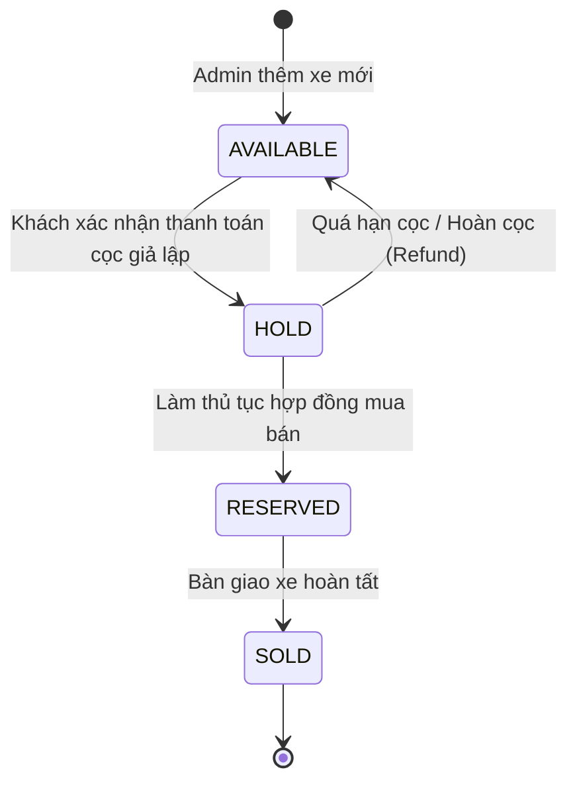

# TÀI LIỆU ĐẶC TẢ API CHÍNH THỨC (API CONTRACT)
## Đề tài: Hệ thống Quản lý Kinh doanh Ô tô Đã qua Sử dụng
- **Phiên bản:** 3.0.0
- **Ngày ban hành:** 30/09/2026 (Ngày 1 - Kế hoạch 3 ngày)
- **Người phụ trách (Owner):** TV1 (Backend Core & Integration)
- **Đối tượng sử dụng:** 
  - TV2 (Frontend): Dùng làm căn cứ kết nối API và xử lý state UI
  - TV3 (Database): Dùng làm căn cứ thiết kế schema và constraints
  - TV4 (Auth): Dùng làm căn cứ phân quyền các endpoint
  - TV5 (UML/SRS): Dùng làm căn cứ vẽ Sequence & Collaboration Diagram

---

## 1. NGUYÊN TẮC THIẾT KẾ VÀ QUY CHUẨN CHUNG

1. **Base URL:** `http://localhost:8080/api/v1`
2. **Định dạng dữ liệu:** `application/json; charset=UTF-8`
3. **Cơ chế xác thực (Tạm thời vs Chính thức):**
   - *Giai đoạn đầu Ngày 1 (chờ TV4 bàn giao Auth):* Các API yêu cầu người dùng sẽ tạm thời nhận `userId` qua Request Header `X-User-Id: <id>` (mặc định `1` nếu không truyền).
   - *Sau khi TV4 hoàn tất:* Chuyển sang Bearer Token: `Authorization: Bearer <jwt_token>`.
4. **Chuẩn mã trạng thái HTTP (HTTP Status Codes):**
   - `200 OK`: Truy vấn hoặc cập nhật thành công.
   - `201 Created`: Tạo mới thành công (Tạo xe, Tạo đơn cọc).
   - `400 Bad Request`: Dữ liệu đầu vào sai định dạng hoặc vi phạm ràng buộc (ngày hẹn trong quá khứ, thiếu trường bắt buộc).
   - `401 Unauthorized`: Chưa đăng nhập hoặc token không hợp lệ/hết hạn.
   - `403 Forbidden`: Người dùng không có quyền truy cập endpoint (VD: CUSTOMER truy cập Admin API).
   - `404 Not Found`: Không tìm thấy bản ghi (Xe, Đơn cọc, Lịch hẹn).
   - `409 Conflict`: **Xung đột nghiệp vụ (Trùng đặt cọc xe)** - Xe không còn ở trạng thái `AVAILABLE`.
   - `422 Unprocessable Entity`: Dữ liệu hợp lệ về cú pháp nhưng vi phạm logic nghiệp vụ.

---

## 2. MA TRẬN CHUYỂN ĐỔI TRẠNG THÁI (STATE TRANSITIONS)

### 2.1. Trạng thái Xe (`Vehicle.status`)


### 2.2. Trạng thái Đơn cọc (`Deposit.status`)
* `PENDING`: Đã tạo đơn cọc, đang chờ khách quét QR thanh toán giả lập.
* `DEPOSITED`: Đã thanh toán cọc thành công, xe đã bị khóa `HOLD`.
* `CANCELLED`: Khách hủy cọc hoặc quá thời hạn thanh toán.
* `REFUNDED`: Admin duyệt hoàn tiền cọc cho khách theo chính sách.

### 2.3. Trạng thái Lịch hẹn (`Appointment.status`)
* `PENDING`: Khách đã đặt lịch, chờ đến ngày giờ đến showroom.
* `COMPLETED`: Nhân viên showroom (Staff) đã đón tiếp khách thực tế (kèm xác nhận lái thử nếu có).
* `CANCELLED`: Khách báo hủy hẹn hoặc không đến.

---

## 3. CHI TIẾT CÁC ENDPOINTS

### 3.0. Phân hệ Xác thực & Phân quyền (Auth & Identity - TV4 phụ trách)

#### 1. Đăng nhập hệ thống
* **Method:** `POST`
* **URL:** `/api/v1/auth/login`
* **Request Body:**
```json
{
  "email": "customer@gmail.com",
  "password": "Password123@"
}
```
* **Response (200 OK):**
```json
{
  "token": "eyJhbGciOiJIUzI1NiIsInR5cCI6IkpXVCJ9...",
  "tokenType": "Bearer",
  "user": {
    "id": 1,
    "email": "customer@gmail.com",
    "fullName": "Nguyễn Văn A",
    "role": "CUSTOMER"
  }
}
```
* **Response (401 Unauthorized):** Khi sai email hoặc mật khẩu (`{"status": 401, "error": "Unauthorized", "message": "Email hoặc mật khẩu không chính xác"}`).
* **Response (403 Forbidden):** Khi tài khoản bị khóa `is_active = false`.

#### 2. Đăng ký tài khoản khách hàng
* **Method:** `POST`
* **URL:** `/api/v1/auth/register`
* **Request Body:**
```json
{
  "email": "newcustomer@gmail.com",
  "password": "Password123@",
  "fullName": "Trần Thị B",
  "phone": "0912345678"
}
```
* **Response (201 Created):** `{"message": "Đăng ký tài khoản thành công", "userId": 2}`
* **Response (409 Conflict):** Khi email đã tồn tại trong hệ thống.

#### 3. Lấy thông tin tài khoản hiện tại (Current User Contract)
* **Method:** `GET`
* **URL:** `/api/v1/auth/me`
* **Header:** `Authorization: Bearer <jwt_token>`
* **Response (200 OK):** Thông tin người dùng hiện tại kèm vai trò (`CUSTOMER`, `STAFF`, `ADMIN`).

#### 4. Quên mật khẩu & Gửi OTP (Email / Demo OTP)
* **Method:** `POST`
* **URL:** `/api/v1/auth/forgot-password`
* **Request Body:** `{"email": "customer@gmail.com"}`
* **Response (200 OK):** `{"message": "Mã xác thực OTP đã được gửi đến email (thời hạn 90 giây)", "demoOtp": "123456"}`

#### 5. Đặt lại mật khẩu với OTP
* **Method:** `POST`
* **URL:** `/api/v1/auth/reset-password`
* **Request Body:**
```json
{
  "email": "customer@gmail.com",
  "otp": "123456",
  "newPassword": "NewPassword123@"
}
```
* **Response (200 OK):** `{"message": "Đổi mật khẩu thành công. Vui lòng đăng nhập lại."}`
* **Response (400 Bad Request):** Khi OTP sai hoặc đã hết hạn (> 90s).

---

### 3.1. Phân hệ Xe (Vehicle Catalog & Admin CRUD)

#### [PUBLIC] 1. Tìm kiếm và lọc danh sách xe
* **Method:** `GET`
* **URL:** `/api/v1/vehicles`
* **Query Parameters:**
  * `keyword` (String, optional): Tìm theo hãng hoặc dòng xe (vd: "Mazda", "CX-5")
  * `brand` (String, optional): Hãng xe (Toyota, Mazda, Honda...)
  * `minPrice` (BigDecimal, optional): Giá tối thiểu (VND)
  * `maxPrice` (BigDecimal, optional): Giá tối đa (VND)
  * `minYear` / `maxYear` (Integer, optional): Năm sản xuất
  * `transmission` (String, optional): 'Automatic', 'Manual', 'CVT'
  * `fuelType` (String, optional): 'Gasoline', 'Diesel', 'Hybrid', 'Electric'
  * `showroomId` (Long, optional): Lọc theo cơ sở showroom
  * `status` (String, optional, default='AVAILABLE'): Trạng thái xe
  * `page` (int, default=0), `size` (int, default=10), `sort` (vd: "price,asc", "createdAt,desc")
* **Response (200 OK):**
```json
{
  "content": [
    {
      "id": 1,
      "vin": "VN-TOYOTA-CAMRY-2021-001",
      "brand": "Toyota",
      "model": "Camry",
      "variant": "2.5Q",
      "manufactureYear": 2021,
      "price": 1050000000.00,
      "mileage": 35000,
      "fuelType": "Gasoline",
      "transmission": "Automatic",
      "color": "Trắng ngọc trai",
      "imageUrl": "https://example.com/images/camry.jpg",
      "status": "AVAILABLE",
      "showroom": {
        "id": 1,
        "name": "Showroom Thủ Đức",
        "address": "Số 1 Võ Văn Ngân, TP. Thủ Đức, TP.HCM",
        "phone": "0901234567"
      }
    }
  ],
  "pageNo": 0,
  "pageSize": 10,
  "totalElements": 1,
  "totalPages": 1,
  "last": true
}
```

#### [PUBLIC] 2. Lấy chi tiết xe
* **Method:** `GET`
* **URL:** `/api/v1/vehicles/{id}`
* **Response (200 OK):** Chi tiết đầy đủ thông số kỹ thuật, số khung (VIN), tình trạng ODO, địa chỉ showroom và nút liên hệ tư vấn.
* **Response (404 Not Found):** Nếu `id` không tồn tại.

#### [ADMIN] 3. Thêm mới xe vào kho (CRUD)
* **Method:** `POST`
* **URL:** `/api/v1/admin/vehicles`
* **Role yêu cầu:** `ADMIN`
* **Request Body:**
```json
{
  "vin": "VN-HONDA-CRV-2022-002",
  "brand": "Honda",
  "model": "CR-V",
  "variant": "1.5L Turbo",
  "manufactureYear": 2022,
  "fuelType": "Gasoline",
  "transmission": "CVT",
  "engineSize": 1.5,
  "seatCount": 7,
  "origin": "Domestic",
  "bodyType": "SUV",
  "price": 890000000,
  "mileage": 28000,
  "color": "Đen",
  "imageUrl": "https://example.com/crv.jpg",
  "showroomId": 1,
  "description": "Xe gia đình giữ gìn, bảo dưỡng định kỳ chính hãng"
}
```
* **Response (201 Created):** Bản ghi xe vừa tạo với `status = "AVAILABLE"`.
* **Response (400 Bad Request):** Nếu thiếu thông tin bắt buộc hoặc số VIN bị trùng lặp.

#### [ADMIN] 4. Cập nhật thông tin xe
* **Method:** `PUT`
* **URL:** `/api/v1/admin/vehicles/{id}`
* **Role yêu cầu:** `ADMIN`
* **Response (200 OK):** Thông tin xe đã cập nhật.

#### [ADMIN] 5. Xóa xe
* **Method:** `DELETE`
* **URL:** `/api/v1/admin/vehicles/{id}`
* **Role yêu cầu:** `ADMIN`
* **Response (200 OK):** `"Xóa thành công xe với ID: ..."`
* **Response (409 Conflict):** Không cho phép xóa xe đang có đơn cọc ở trạng thái `HOLD` hoặc `DEPOSITED`.

---

### 3.2. Phân hệ Đặt cọc & Lịch hẹn (Deposit & Appointment)

#### [CUSTOMER] 1. Khởi tạo đơn đặt cọc & hẹn ngày xem xe
* **Method:** `POST`
* **URL:** `/api/v1/deposits`
* **Role yêu cầu:** `CUSTOMER` (hoặc Header `X-User-Id` trong Ngày 1)
* **Request Body:**
```json
{
  "vehicleId": 1,
  "showroomId": 1,
  "appointmentDate": "2026-10-02T09:30:00",
  "hasTestDrive": true,
  "customerName": "Nguyễn Văn A",
  "customerPhone": "0987654321",
  "customerEmail": "nguyenvana@gmail.com",
  "note": "Hẹn sáng thứ 6 xem xe và chạy thử trên đại lộ"
}
```
* **Quy trình xử lý của Backend:**
  1. Kiểm tra xe `vehicleId` tồn tại và `status == 'AVAILABLE'`. Nếu không $\rightarrow$ trả `409 Conflict`.
  2. Tạo bản ghi `Deposit` với `status = 'PENDING'`, `amount = 10000000` (10 triệu VND).
  3. Sinh mã `depositCode` duy nhất (VD: `DEP-20260930-9948`).
  4. Tạo mã QR thanh toán giả lập (Mock QR) chứa thông tin chuyển khoản và `depositCode`.
  5. Tạo bản ghi `Appointment` liên kết với đơn cọc, lưu `hasTestDrive = true/false`.
* **Response (201 Created):**
```json
{
  "depositId": 12,
  "depositCode": "DEP-20260930-9948",
  "vehicleId": 1,
  "vehicleTitle": "Toyota Camry 2.5Q 2021",
  "depositAmount": 10000000.00,
  "status": "PENDING",
  "qrPaymentUrl": "https://api.vietqr.io/image/970422-999999999-compact2.jpg?amount=10000000&addInfo=DEP-20260930-9948",
  "appointment": {
    "appointmentId": 8,
    "appointmentDate": "2026-10-02T09:30:00",
    "hasTestDrive": true,
    "showroomName": "Showroom Thủ Đức",
    "showroomAddress": "Số 1 Võ Văn Ngân, TP. Thủ Đức, TP.HCM"
  },
  "expiresAt": "2026-09-30T08:00:00"
}
```

#### [CUSTOMER] 2. Xác nhận thanh toán cọc giả lập & Khóa xe (Race-Condition Safe)
* **Method:** `POST`
* **URL:** `/api/v1/deposits/{id}/confirm`
* **Role yêu cầu:** `CUSTOMER`
* **Mục đích:** Người dùng sau khi quét QR giả lập bấm nút **"Đã thanh toán cọc"**.
* **Xử lý Transaction chống cọc trùng:**
  ```sql
  UPDATE vehicles 
  SET status = 'HOLD' 
  WHERE id = :vehicleId AND status = 'AVAILABLE';
  ```
  - Nếu số dòng cập nhật $= 1$: Cọc thành công $\rightarrow$ chuyển đơn cọc sang `DEPOSITED` $\rightarrow$ sinh biên lai/hợp đồng số $\rightarrow$ ghi sổ cái Ledger.
  - Nếu số dòng cập nhật $= 0$: Xe đã bị người khác cọc trước trong cùng mili-giây $\rightarrow$ Rollback và trả về `409 Conflict`.
* **Response (200 OK):**
```json
{
  "depositId": 12,
  "depositCode": "DEP-20260930-9948",
  "status": "DEPOSITED",
  "vehicleStatus": "HOLD",
  "receiptCode": "REC-20260930-12",
  "contractNumber": "HD-COC-2026-0012",
  "confirmedAt": "2026-09-30T07:45:00Z",
  "message": "Đặt cọc giữ xe thành công! Xe đã được khóa trạng thái giữ chỗ cho quý khách."
}
```
* **Response (409 Conflict):**
```json
{
  "timestamp": "2026-09-30T07:45:01Z",
  "status": 409,
  "error": "Conflict",
  "message": "Rất tiếc! Xe này vừa được một khách hàng khác đặt cọc thành công cách đây ít giây. Giao dịch giữ xe bị hủy."
}
```

#### [CUSTOMER] 3. Xem biên lai thu tiền cọc và Hợp đồng số điện tử (FR-10)
* **Method:** `GET`
* **URL:** `/api/v1/deposits/{id}/receipt`
* **Role yêu cầu:** `CUSTOMER` (hoặc `ADMIN`)
* **Response (200 OK):** Trả về toàn bộ thông tin hợp đồng số: Bên A (Showroom), Bên B (Khách hàng), Xe đặt cọc (VIN, Biển số, ODO, Giá bán), Số tiền cọc, Thời hạn giữ cọc (7 ngày), Điều khoản hoàn cọc và Lịch hẹn kèm tùy chọn lái thử.

#### [CUSTOMER] 4. Quản lý danh sách đơn cọc của tôi (UC-12)
* **Method:** `GET`
* **URL:** `/api/v1/deposits/my`
* **Role yêu cầu:** `CUSTOMER`
* **Response (200 OK):** Danh sách các đơn cọc mà user hiện tại đã tạo kèm trạng thái (`PENDING`, `DEPOSITED`, `CANCELLED`).

---

### 3.3. Phân hệ Nhân viên Showroom (Staff Appointment Management)

#### [STAFF] 1. Xem danh sách lịch hẹn khách đến xem xe (FR-12, UC-13)
* **Method:** `GET`
* **URL:** `/api/v1/staff/appointments`
* **Role yêu cầu:** `STAFF` (hoặc `ADMIN`)
* **Query Parameters:**
  * `date` (LocalDate, optional): Ngày hẹn (mặc định lấy hôm nay)
  * `showroomId` (Long, optional): Lọc theo showroom của nhân viên
  * `status` (String, optional): 'PENDING', 'COMPLETED', 'CANCELLED'
* **Response (200 OK):**
```json
[
  {
    "appointmentId": 8,
    "customerName": "Nguyễn Văn A",
    "customerPhone": "0987654321",
    "vehicleInfo": "Toyota Camry 2.5Q 2021 (VIN: VN-TOYOTA-CAMRY-2021-001)",
    "appointmentDate": "2026-10-02T09:30:00",
    "hasTestDrive": true,
    "status": "PENDING",
    "depositCode": "DEP-20260930-9948"
  }
]
```

#### [STAFF] 2. Xác nhận khách đã đến showroom / đã lái thử (UC-14)
* **Method:** `PUT`
* **URL:** `/api/v1/staff/appointments/{id}/check-in`
* **Role yêu cầu:** `STAFF`
* **Request Body:**
```json
{
  "testDriveCompleted": true,
  "staffNote": "Khách hàng đã đến đúng giờ, trải nghiệm lái thử hài lòng và hẹn ngày mai hoàn tất hợp đồng chuyển quyền sở hữu."
}
```
* **Response (200 OK):**
```json
{
  "appointmentId": 8,
  "status": "COMPLETED",
  "staffNote": "Khách hàng đã đến đúng giờ...",
  "updatedAt": "2026-10-02T10:15:00Z"
}
```

---

### 3.4. Phân hệ Quản trị Sổ cái Tiền cọc (Admin Ledger)

#### [ADMIN] 1. Xem danh sách sổ cái cọc (FR-14, UC-18)
* **Method:** `GET`
* **URL:** `/api/v1/admin/ledger`
* **Role yêu cầu:** `ADMIN`
* **Response (200 OK):**
```json
{
  "totalDepositsCount": 15,
  "totalHoldingAmount": 150000000.00,
  "transactions": [
    {
      "ledgerId": 1,
      "depositCode": "DEP-20260930-9948",
      "customerName": "Nguyễn Văn A",
      "vehicleVin": "VN-TOYOTA-CAMRY-2021-001",
      "amount": 10000000.00,
      "transactionType": "DEPOSIT_HOLD",
      "status": "CONFIRMED",
      "createdAt": "2026-09-30T07:45:00Z"
    }
  ]
}
```

#### [ADMIN] 2. Phê duyệt hoàn trả tiền cọc cho khách (FR-14)
* **Method:** `POST`
* **URL:** `/api/v1/admin/ledger/{depositId}/refund`
* **Role yêu cầu:** `ADMIN`
* **Request Body:**
```json
{
  "refundReason": "Xe có lỗi ngoại quan khi kiểm định thực tế theo chính sách bảo hành showroom",
  "refundAmount": 10000000.00
}
```
* **Xử lý:** Chuyển trạng thái đơn cọc sang `REFUNDED`, mở khóa trạng thái xe từ `HOLD` trở về `AVAILABLE` để người khác có thể cọc lại.
* **Response (200 OK):**
```json
{
  "depositId": 12,
  "status": "REFUNDED",
  "vehicleStatus": "AVAILABLE",
  "refundedAt": "2026-10-02T11:00:00Z",
  "message": "Hoàn cọc thành công. Trạng thái xe đã được mở lại thành AVAILABLE."
}
```

---
