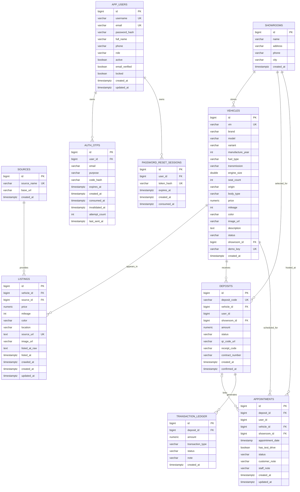

# ERD — Current Increment

Ngày đồng bộ: 01/10/2026

## 1. Current relational model

Nguồn đối chiếu: `database/schema/schema.sql`, migrations `V3_0_0`..`V3_0_4` và current JPA entities.

### Physical-FK caveat

`deposits.user_id` và `appointments.user_id` hiện **chưa** có FK sang `app_users(id)` trong V3 migrations. Do đó ERD chỉ biểu diễn các FK thực tế; đây không phải omission.

## 2. Current state constraints

### Vehicle

`ARCHIVED`, `AVAILABLE`, `HOLD`, `RESERVED`, `SOLD`.

`ARCHIVED` là boundary từ V3_0_1 cho cấu hình marketplace không có showroom; không phải inventory để deposit.

### Deposit

`PENDING`, `DEPOSITED`, `CANCELLED`, `REFUNDED`.

### Appointment

`PENDING`, `COMPLETED`, `CANCELLED`.

### Auth

- Role: `CUSTOMER`, `STAFF`, `ADMIN`.
- OTP purpose: `VERIFY_EMAIL`, `RESET_PASSWORD`.

## 3. Important database findings

1. `V3_0_0` bổ sung showroom/deposit/appointment/ledger.
2. `V3_0_1` bổ sung archive boundary và `demo_key`.
3. `V3_0_2` bổ sung unique index chống nhiều `DEPOSITED` trên cùng vehicle và `amount > 0`.
4. `V3_0_3` bổ sung ledger CHECK và appointment indexes.
5. `V3_0_4` tạo `app_users`, `auth_otps`, `password_reset_sessions`.
6. `database/schema/schema.sql` vẫn là destructive v2.0.1 bootstrap cho 3 bảng market-data; muốn runtime hiện tại phải chạy thêm migration chain.
7. `user_id` của deposit/appointment là identity scalar trong business tables và chưa có physical FK tới `app_users`.

## 4. TV5 status

**ERD documentation: UPDATED / implementation-aware.**

Clean-bootstrap contract vẫn là dependency của TV3.
