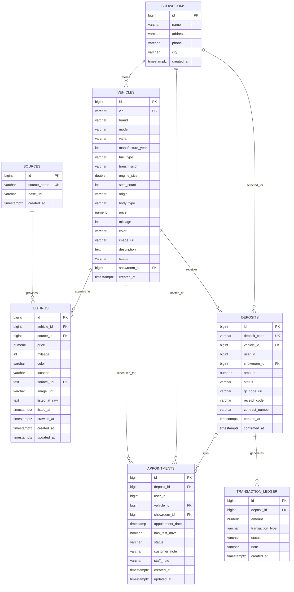

# ERD — Current Increment

Ngày đồng bộ: 30/09/2026

## 1. Current relational model

Nguồn đối chiếu: `database/schema/schema.sql` + `database/migrations/V3_0_0__showroom_deposit_appointment.sql` + current JPA entities.

## 2. Current state constraints

### Vehicle

`AVAILABLE`, `HOLD`, `RESERVED`, `SOLD`

### Deposit

`PENDING`, `DEPOSITED`, `CANCELLED`, `REFUNDED`

### Appointment

`PENDING`, `COMPLETED`, `CANCELLED`

## 3. Important database findings

1. `V3_0_0__showroom_deposit_appointment.sql` contains the current V3 business tables and vehicle extensions.
2. `database/schema/schema.sql` is still a v2.0.1 destructive bootstrap containing only `sources`, `vehicles`, `listings`.
3. Therefore the repository currently has **two schema layers that are not yet presented as one clear clean-bootstrap contract**.
4. `user_id` in `deposits`/`appointments` has no `users` table or FK in the current V3 migration.
5. The DB model has no role table/permission model yet because TV4 auth backend is not implemented.
6. These DB implementation issues belong to **TV3**; TV5's task is to keep ERD/traceability accurate and report the discrepancy.

## 4. TV5 status

**ERD documentation: PARTIAL until TV3 confirms the authoritative clean-bootstrap sequence.**
