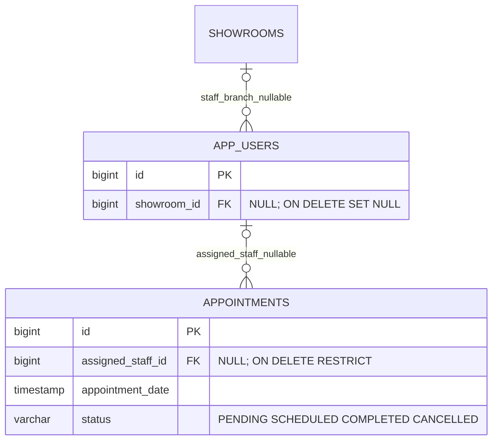
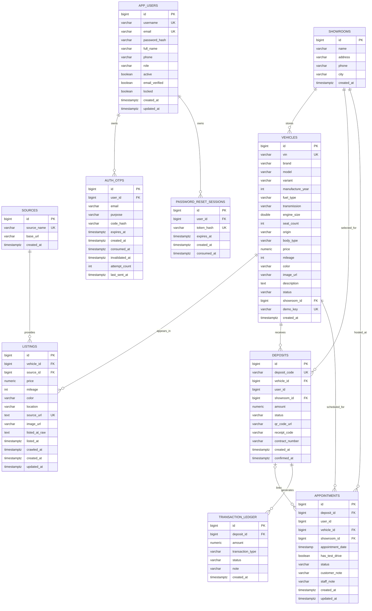
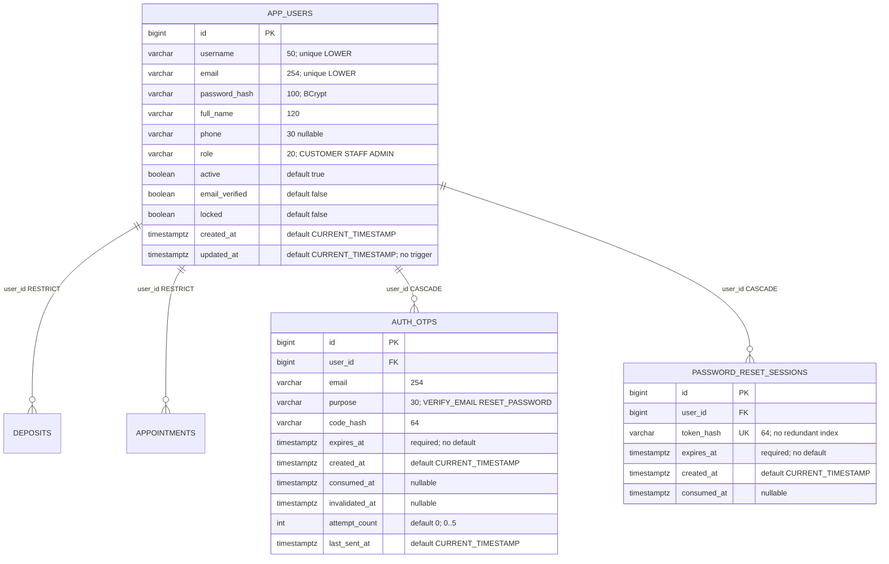

## Quan hệ bổ sung V3_0_7 — 02/10/2026

Phần này cập nhật mô hình lịch sử bên dưới. Contract chi tiết: [Staff Appointment Handoff](../../../database/guides/Staff_Appointment_Handoff.md).

Partial UNIQUE (assigned_staff_id,appointment_date) với PENDING/SCHEDULED ngăn trùng chính xác thời điểm; COMPLETED/CANCELLED không giữ slot. Không tự phân công lịch cũ. FK chỉ xác minh account tồn tại; TV4 xác minh STAFF/active/unlocked/cùng showroom. Evidence catalog: `database/evidence/staff_appointments_20261002_03/result.json`.

## Consolidation chính thức TV3 — 01/10/2026

Baseline: `origin/main` tại `cb2c520`; checkout `AutoTrade-TV3` là worktree branch `TV3` (cùng repository với `AutoTrade`). Lịch sử TV3 `5ba28b9` đã là ancestor của main; fast-forward giữ nguyên commit cũ. Auth TV4 `48c8f88` đã merge upstream, không copy Backend/Frontend cũ từ AutoTrade-main. Không có AGENTS.md trong ba checkout hoặc các thư mục cha đã kiểm tra.

Thứ tự bootstrap mới: **schema.sql → V3_0_0 → V3_0_1 → V3_0_2 → V3_0_3 → V3_0_4 → V3_0_5 → showroom seed → auth seed**. `V2_0_1` chỉ upgrade v2.0.0, không replay sau clean schema. Existing V3_0_4 chỉ chạy `V3_0_5__auth_identity_integrity.sql` sau preflight/backup riêng. Không chạy schema/reset/seed lên database shared/audit. Repository hiện chạy migration bằng psql, chưa cấu hình Flyway; migration mới là SQL PostgreSQL thuần, không có psql include, có BEGIN/COMMIT và locks.

V3_0_4 và các migration cũ giữ nguyên. V3_0_5 kiểm tra exact 29 columns/types/defaults/nullability, từ chối incompatible schema, invalid/duplicate identities và orphan trước khi thêm integrity; không sửa/xóa rows hoặc tạo user vá dữ liệu. Giữ OTP/reset CASCADE, reset UNIQUE, OTP index `idx_auth_otps_active_lookup`; thêm username/email LOWER UNIQUE và business user RESTRICT. Chỉ bỏ ordinary `idx_password_reset_sessions_token` sau khi xác nhận đúng định nghĩa V3_0_4. Thêm CHECK required identity (email hợp lệ, full_name/password_hash không trống), username và normalized email; không thêm lifecycle trigger hoặc time-based CHECK.

Demo accounts `customer/staff/admin` chỉ local, hash BCrypt cost12 truyền qua environment; seed từ chối collision, không overwrite password/role/state. Operator phải cấp credential/hash riêng qua kênh riêng; random credential dùng trong verification không phải credential bàn giao. Schema giữ một role/user, không có staff-showroom. Soft disable bảo toàn lịch sử.

Auth fix: lưu failed OTP attempt/expiry invalidation qua cả hai transaction boundaries, khóa user khi verify để serial hóa với resend và ngăn dùng OTP đồng thời. Email normalization dùng Locale.ROOT; length validation khớp DB. Race đăng ký trả 409 cho identity UNIQUE thay vì 500. SMTP_FROM lấy từ SMTP_USERNAME nếu không được cấu hình riêng; không hard-code địa chỉ gửi hoặc secrets.

Evidence mới cho official sequence: `database/evidence/official_20261001_030621_7a31e3/`. Các bằng chứng candidate nhập dưới `database/evidence/historical/` chỉ có giá trị lịch sử. Những mô tả pending/candidate ở phần lịch sử phía dưới đã được supersede bởi mục này; không dùng candidate để bootstrap chính thức.

Dependency còn thiếu: **SMTP_USERNAME, SMTP_PASSWORD**, mailbox access/recipient để kiểm chứng nhận OTP thật. Host/port default smtp.gmail.com:587 STARTTLS; SMTP_FROM fallback SMTP_USERNAME. Activation email receipt → verify delivered OTP → login → /auth/me và real reset email: **NOT RUN**. Không fake delivery, không lộ OTP, không bypass verification. Không tuyên bố TV3/Gate2 đã hoàn tất toàn bộ.

## Lịch sử thiết kế/bàn giao (giữ nguyên nội dung nguồn)

# ERD — Current Increment

Ngày đồng bộ: 01/10/2026

## 1. Current relational model

Nguồn đối chiếu: `database/schema/schema.sql`, migrations `V3_0_0`..`V3_0_4` và current JPA entities.

### Physical-FK caveat

`deposits.user_id` và `appointments.user_id` hiện **chưa** có FK sang `app_users(id)` trong V3 migrations. Do đó ERD chỉ biểu diễn các FK thực tế; đây không phải omission.

## 2. Current state constraints

### Vehicle

`ARCHIVED`, `AVAILABLE`, `HOLD`, `RESERVED`, `SOLD`.

`ARCHIVED` là boundary từ V3_0_1 cho cấu hình marketplace không có showroom; không phải inventory để deposit.

### Deposit

`PENDING`, `DEPOSITED`, `CANCELLED`, `REFUNDED`.

### Appointment

`PENDING`, `COMPLETED`, `CANCELLED`.

### Auth

- Role: `CUSTOMER`, `STAFF`, `ADMIN`.
- OTP purpose: `VERIFY_EMAIL`, `RESET_PASSWORD`.

## 3. Important database findings

1. `V3_0_0` bổ sung showroom/deposit/appointment/ledger.
2. `V3_0_1` bổ sung archive boundary và `demo_key`.
3. `V3_0_2` bổ sung unique index chống nhiều `DEPOSITED` trên cùng vehicle và `amount > 0`.
4. `V3_0_3` bổ sung ledger CHECK và appointment indexes.
5. `V3_0_4` tạo `app_users`, `auth_otps`, `password_reset_sessions`.
6. `database/schema/schema.sql` vẫn là destructive v2.0.1 bootstrap cho 3 bảng market-data; muốn runtime hiện tại phải chạy thêm migration chain.
7. `user_id` của deposit/appointment là identity scalar trong business tables và chưa có physical FK tới `app_users`.

## 4. TV5 status

**ERD documentation: PARTIAL until TV3 confirms the authoritative clean-bootstrap sequence.**

<!-- Imported TV3 review additions; preceding historical content retained. -->
## Complete physical auth candidate — 01/10/2026

OTP/reset mapping RESOLVED. database/drafts/auth_database_candidate.sql is unversioned, isolated-review implementation. TV4 official V3_0_4 is reserved/absent in workspace, not yet reconciled; official historical business model below remains unchanged.

OTP index (user_id,purpose,created_at DESC). No staff-showroom, role join, active-OTP uniqueness or direct OTP/reset relation. Soft disable preserves history. Exact DD and [integration guide](../../../database/guides/Auth_Identity_Integration.md) define upgrade limitations and official reconciliation.
