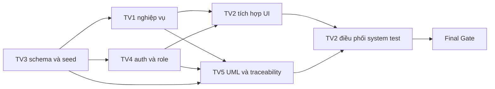

# Workflow 4 Increment - Hệ thống quản lý kinh doanh ô tô đã qua sử dụng

## 1. Nguồn ưu tiên và mục tiêu

Tên đề tài: **Xây dựng hệ thống quản lý kinh doanh ô tô đã qua sử dụng**.

Workflow này áp dụng kế hoạch ba ngày đã được nhóm chốt trong `docs/Project/Ke_hoach_3_ngay_phan_cong_nhiem_vu.docx`. Khi có mâu thuẫn, kế hoạch DOCX và workflow này được ưu tiên hơn các mission/report cũ.

Mục tiêu nộp: hệ thống Spring Boot + React + PostgreSQL chạy được một quy trình quản lý xe cũ có xác thực, phân quyền, quản lý xe, đặt cọc giả lập, lịch hẹn và kiểm thử có bằng chứng.

## 2. Quyết định kỹ thuật đã khóa

- Giữ stack hiện có: Spring Boot, React, PostgreSQL và JPA.
- Không viết lại dự án theo Servlet/JSP, SQL Server hoặc MySQL trong giai đoạn ba ngày.
- Không có Machine Learning, hồi quy tuyến tính, R Plumber, định giá tự động, Recommendation hoặc Comparison trong phạm vi nộp.
- Không có giỏ hàng, thanh toán 100% giá xe, cổng VNPay/MoMo thật hoặc escrow pháp lý.
- Đặt cọc chỉ là giao dịch giả lập bằng QR/reference; không phát sinh tiền thật.
- Lái thử là checkbox tùy chọn của lịch hẹn, không phải module hoặc Use Case riêng.
- `crawler/` và dữ liệu crawler là dữ liệu hiện có, không sửa hoặc xóa trong kế hoạch này.

## 3. Phạm vi ưu tiên

| Mức | Phạm vi | Quyết định khi trễ |
|---|---|---|
| P0 | Đăng nhập/phân quyền; showroom; tìm kiếm/lọc/chi tiết xe; Admin CRUD xe; đặt cọc giả lập; lịch hẹn; khóa xe; chống cọc trùng; test/UML cho luồng chính | Bắt buộc hoàn thành trước Gate 2 |
| P1 | Đăng ký, quên mật khẩu OTP, yêu thích, lịch sử cọc, Staff cập nhật lịch hẹn, Admin ledger/tài khoản/thống kê cơ bản | Chỉ làm khi P0 ổn định |
| P2 | QR đẹp, hợp đồng/biên lai tải về, contact link, gallery nhiều ảnh, chart nâng cao | Hoãn hoặc mô phỏng trước |
| Loại bỏ | Regression/ML, Recommendation, Comparison, thanh toán thật, giỏ hàng, workflow lái thử độc lập | Không triển khai, không mô tả như chức năng đã có |

## 4. Actor và nghiệp vụ chính

| Actor | Quyền trong phạm vi |
|---|---|
| Khách vãng lai | Xem showroom, tìm kiếm/lọc, xem chi tiết xe, liên hệ nhanh |
| CUSTOMER | Đăng nhập, đặt cọc giả lập, tạo lịch hẹn, xem đơn cọc của mình |
| STAFF | Xem và cập nhật trạng thái lịch hẹn showroom |
| ADMIN | CRUD xe, quản lý tài khoản, xem ledger cọc và thao tác quản trị được chốt |
| System | Phát OTP thật hoặc OTP demo có hạn dùng; tạo QR/reference giả lập |

### Trạng thái tối thiểu

```text
Vehicle: AVAILABLE -> HOLD/RESERVED -> AVAILABLE hoặc SOLD
Deposit: PENDING_PAYMENT -> DEPOSITED -> REFUNDED hoặc RELEASED
Appointment: SCHEDULED -> COMPLETED hoặc CANCELLED
```

Quy tắc bắt buộc:

- Chỉ xe `AVAILABLE` được tạo đặt cọc.
- Một xe không có hai đặt cọc giữ chỗ thành công cùng lúc.
- Xác nhận cọc và chuyển trạng thái xe phải chạy trong transaction.
- Lịch hẹn không được ở quá khứ.
- CUSTOMER không được gọi API STAFF/ADMIN; Backend mới là nơi quyết định quyền.
- Callback/reference lặp không tạo thêm transaction.

## 5. Phân công và phụ thuộc

| TV | Sở hữu | Bàn giao chính |
|---|---|---|
| TV1 | Vehicle API, Admin CRUD, deposit, appointment, transaction, Staff/Admin API | API contract, business test, OpenAPI |
| TV2 | React UI và Test Lead | UI tích hợp, Test Plan/Case/Report, Defect Log, evidence |
| TV3 | PostgreSQL migration, seed, constraint, Data Dictionary | Schema/seed/reset/test SQL |
| TV4 | Auth, password hash, JWT/session, role, OTP fallback | Auth API/current-user contract/security test |
| TV5 | SRS, Use Case, Sequence, Collaboration, Class, ERD, traceability | UML/SRS/truy vết/checklist nộp |



## 6. Kế hoạch Ngày 1 - Khóa contract và dựng lõi

### Mục tiêu

Database khởi tạo được; login/role cơ bản chạy; API xe và Admin CRUD dùng dữ liệu thật; deposit/appointment có skeleton; UI có route chính; UML tổng thể bám contract.

| Thời điểm | Owner | Việc và bàn giao |
|---|---|---|
| 08:00-08:30 | Cả nhóm | Khóa P0/P1/P2, enum/status/tên endpoint. TV2 mở Defect Log, TV5 mở traceability. |
| 08:30-10:00 | TV3 | ERD vật lý, migration draft, enum/status/FK/index; gửi TV1/TV4/TV5 review. |
| 08:30-10:00 | TV1 + TV4 | Chốt auth/business API contract và error `400/401/403/404/409/422`. |
| 08:30-11:00 | TV2 + TV5 | TV2 dựng UI skeleton/Test Plan; TV5 đồng bộ SRS/Use Case/Sequence draft. |
| 10:30-12:00 | TV3 | Migration/seed/reset chạy được; có CUSTOMER/STAFF/ADMIN và xe demo. |
| 10:30-17:00 | TV1 | Public vehicle API, Admin CRUD, deposit/appointment skeleton. |
| 10:30-17:00 | TV4 | Login, password hash, security filter, role protection, current-user contract. |
| 12:30-17:30 | TV2 | Nối showroom/detail/filter/login với API, ghi mismatch. |
| 13:00-17:30 | TV5 | Use Case và Sequence login/search/CRUD/deposit draft theo code/contract. |
| 17:30-19:00 | Cả nhóm | Gate 1 và test module; TV2 ghi evidence. |

### Gate 1

- DB sạch khởi tạo và seed được.
- CUSTOMER/STAFF/ADMIN đăng nhập được; CUSTOMER bị chặn API Admin.
- Showroom/detail/filter và Admin CRUD gọi API thật.
- Use Case tổng thể, Sequence login/CRUD và Test Plan P0 đã được review.

## 7. Kế hoạch Ngày 2 - Hoàn thành nghiệp vụ và tích hợp

### Mục tiêu

Luồng vàng chạy từ đăng nhập đến đặt cọc, khóa xe, lịch hẹn và quản trị giao dịch; P0 không còn mock.

| Thời điểm | Owner | Việc và bàn giao |
|---|---|---|
| 08:00-08:30 | Cả nhóm | Triage lỗi Gate 1; không nhận chức năng mới. |
| 08:30-12:00 | TV1 | Deposit/lịch hẹn/ledger tối thiểu, transaction và chặn cọc trùng; gửi API TV2. |
| 08:30-12:00 | TV4 | Register/logout/OTP hoặc fallback demo, account lock và auth tests. |
| 08:30-11:00 | TV3 | Constraint/index/test SQL/seed tình huống AVAILABLE-HOLD; schema freeze lúc 11:00. |
| 08:30-12:00 | TV2 | Auth/Admin CRUD/deposit/lịch hẹn/mock QR UI; validation và error state. |
| 08:30-16:00 | TV5 | UC P0/P1, Sequence/Collaboration/Class/ERD/traceability theo implementation. |
| 13:00-16:00 | TV1 + TV2 + TV4 | Tích hợp token/role, deposit/lịch hẹn và xử lý errors. |
| 16:00-19:00 | Cả nhóm | Gate 2, luồng vàng và test âm do TV2 điều phối. |

### Luồng vàng Gate 2

1. Khách vãng lai xem, tìm kiếm/lọc và mở xe `AVAILABLE`.
2. CUSTOMER đăng nhập, chọn showroom/ngày giờ, tích tùy chọn lái thử và tạo đặt cọc giả lập.
3. Hệ thống lưu deposit/lịch hẹn, xác nhận mock payment, chuyển xe sang `HOLD/RESERVED` trong transaction.
4. Tài khoản khác không thể đặt cọc lại xe đó.
5. STAFF xem/cập nhật lịch hẹn; ADMIN xem ledger và CRUD xe.

### Gate 2

- Luồng vàng end-to-end đạt với DB thật.
- Chặn cọc trùng, ngày quá khứ, role sai và callback/submit lặp.
- P0 không dùng mock data hoặc hard-code business result.
- Lỗi Critical/High đều có owner và hạn sửa.

## 8. Kế hoạch Ngày 3 - Kiểm thử và đóng gói

### Mục tiêu

Không còn lỗi Critical/High; hệ thống build được từ hướng dẫn; tài liệu, schema, API và test evidence khớp nhau.

| Thời điểm | Owner | Việc và bàn giao |
|---|---|---|
| 08:00-08:30 | Cả nhóm | Code freeze; chỉ sửa lỗi/tài liệu/demo. |
| 08:30-11:30 | TV2 | System test, Test Report, Defect Log, evidence, responsive check. |
| 08:30-11:30 | TV1 | Sửa lỗi business/integration; kiểm tra transaction/state/duplicate submit. |
| 08:30-11:30 | TV4 | Security test: token, bypass role, password hash, lock, OTP. |
| 08:30-11:30 | TV3 | Migration/seed/reset/constraint/FK/index test từ DB trống. |
| 08:30-11:30 | TV5 | Chốt SRS/UML/ERD/traceability từ code và test thật. |
| 13:00-15:00 | Cả nhóm | System Test Round 2; mỗi TV test chéo một module và hai negative cases. |
| 15:00-16:30 | TV1 + TV3 | Build/deploy rehearsal từ môi trường sạch. |
| 15:00-16:30 | TV2 + TV4 + TV5 | Demo rehearsal, auth/UI evidence và cross-check tài liệu. |
| 16:30-18:30 | Cả nhóm | Final Gate, danh sách hạn chế, chuẩn bị nộp. |

### Final Gate

- Không còn lỗi Critical/High.
- Build/run được bằng lệnh đã ghi; migration/seed tái lập được.
- Test Report có input, expected, actual, status và evidence thật.
- SRS, UML, schema, API, code và demo cùng một scope.
- Không tuyên bố triển khai phần bị cắt.

## 9. Chiến lược kiểm thử

| Nhóm | Owner chính | Case tối thiểu |
|---|---|---|
| Auth/RBAC | TV4, TV2 test chéo | Password sai, token thiếu/sai/hết hạn, role sai, account lock, OTP expiry |
| Xe/tìm kiếm | TV1, TV2 test chéo | CRUD, xe không tồn tại, lọc kết hợp, dữ liệu biên |
| Deposit/lịch hẹn | TV1, cả nhóm | Xe không AVAILABLE, cọc đồng thời, duplicate submit, ngày quá khứ, transition sai |
| Database | TV3, TV1 test chéo | Migration, FK, UNIQUE, CHECK, rollback, seed/reset |
| Frontend | TV2, TV4 test chéo | Loading/empty/error, `401/403/404/409/422`, responsive, reload |
| Tài liệu | TV5, cả nhóm | FR-UC-API-Test khớp code/evidence, không còn scope cũ |

## 10. Phương án cắt giảm

1. Cắt P2 trước: PDF biên lai/hợp đồng đổi thành trang HTML có reference; QR là ảnh giả lập; chart/gallery nâng cao hoãn.
2. Nếu P1 chặn P0: hoãn favorites, OTP email thật, thống kê nâng cao, quản lý tài khoản chi tiết và history mở rộng.
3. Không cắt password hash, authorization, DB transaction/FK/unique, chặn cọc trùng, migration/seed hoặc test âm.
4. Mọi phần hoãn phải nằm trong mục hạn chế/hướng phát triển, không ghi là hoàn thành.

## 11. Tài liệu và bàn giao bắt buộc

- TV1: API contract/OpenAPI, backend test result.
- TV2: Test Plan, Test Case, Defect Log, Test Report, screenshots/demo script.
- TV3: schema/migration, seed/reset guide, Data Dictionary, DB test log.
- TV4: auth contract, security guide/test evidence.
- TV5: SRS, Use Case/spec, Sequence, Collaboration, Class, ERD và traceability matrix.

Mỗi bàn giao phải có file/commit liên quan, hướng dẫn chạy, test result và known limitations. Báo "xong" không thay thế được bằng chứng.

## 12. Mốc cuối

- 30/09/2026: Ngày 1 và Gate 1.
- 01/10/2026: Ngày 2 và Gate 2.
- 02/10/2026: Ngày 3 và Final Gate.
- 03/10/2026: dự phòng sửa lỗi, bổ sung bằng chứng và hoàn thiện báo cáo.
- 04/10/2026: hạn nộp.
