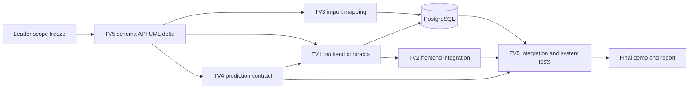

# PROJECT WORKFLOW V2 - HỆ THỐNG QUẢN LÝ KINH DOANH Ô TÔ ĐÃ QUA SỬ DỤNG

## 1. Mục đích và thay đổi phạm vi

Tên đề tài mới: **Xây dựng hệ thống quản lý kinh doanh ô tô đã qua sử dụng**.

Workflow này là nguồn điều phối chính sau khi nhóm mở rộng từ hệ thống tra cứu và định giá sang quy trình đăng bán, kiểm duyệt và đặt cọc giữ xe. Increment 1 và phần lớn Increment 2 đã hoàn thành, vì vậy nhóm không làm lại nền tảng cũ. Ba tuần còn lại tập trung vào một luồng kinh doanh có thể demo và kiểm thử:

```text
Người bán tạo tin
  -> Gửi kiểm duyệt
  -> ML dự đoán giá, Backend gắn cờ nếu giá rao < 50% giá dự đoán
  -> Admin duyệt hoặc từ chối
  -> Tin PUBLISHED xuất hiện trong showroom
  -> Người mua đặt cọc qua cổng thanh toán giả lập
  -> Tin RESERVED
  -> Admin ghi nhận REFUNDED hoặc RELEASED
  -> Tin SOLD khi giao dịch hoàn tất
```

ML định giá trực tiếp cho người dùng vẫn là chức năng cốt lõi. Giá dự đoán chỉ mang tính tham khảo; AI chỉ gắn cờ để Admin xem xét, không tự động từ chối tin.

## 2. Scope freeze cho bản demo

### 2.1. Chức năng bắt buộc

- Showroom: danh sách, chi tiết, tìm kiếm, lọc, phân trang và sắp xếp.
- Đăng ký, đăng nhập và phân quyền `USER`, `ADMIN`.
- `USER` có thể vừa là người mua vừa là người bán tùy từng giao dịch.
- Người bán tạo, sửa, gửi duyệt và rút tin của mình.
- Admin duyệt hoặc từ chối tin; bắt buộc có lý do khi từ chối.
- Định giá xe bằng `regression_v1` qua R Plumber.
- AI risk flag khi `listing_price < predicted_price * 0.5`; bằng đúng 50% thì không gắn cờ.
- Đặt cọc giữ xe bằng payment simulator/sandbox, có idempotency key.
- Admin xem dòng tiền cọc và ghi nhận `REFUNDED` hoặc `RELEASED`.
- Dashboard tổng hợp từ listing, deposit và prediction log.
- Kiểm thử trạng thái, ownership, phân quyền, callback lặp và đặt cọc đồng thời.

### 2.2. Loại khỏi MVP

- Đặt lịch xem xe và lái thử.
- Giỏ hàng, thanh toán 100% giá xe, công chứng và chuyển quyền sở hữu.
- Escrow pháp lý thật, ví nội bộ và chia hoa hồng.
- Chat, thông báo SMS/email và khiếu nại nhiều cấp.
- Yêu thích xe.
- Recommendation Score và Recommendation Engine.
- So sánh 2-3 xe nếu chưa có sẵn khi scope freeze.
- VNPay/MoMo production; chỉ dùng simulator hoặc sandbox.
- AI gian lận phức tạp; chỉ định giá và risk flag theo quy tắc rõ ràng.

Không thành viên nào tự bổ sung chức năng ngoài danh sách bắt buộc trong ba tuần còn lại. Muốn thêm chức năng phải bỏ hoặc giảm một hạng mục khác và được leader chấp nhận.

## 3. Vai trò và ranh giới sở hữu

| Thành viên | Sở hữu chính sau scope change | Không sở hữu |
|---|---|---|
| TV1 | Spring Boot, auth/RBAC, state machine, moderation, deposit simulator, ML client, dashboard API | Schema DB chính thức, model training, React UI |
| TV2 | React, auth UI, seller flow, admin flow, deposit UI, dashboard UI | Business rule và phân quyền phía server |
| TV3 | Canonical dataset, import pipeline, imported-listing mapping, dữ liệu demo tái lập | User listing CRUD, payment, schema DB |
| TV4 | EDA, candidate evaluation, `regression_v1`, Plumber contract, model metrics/version | Moderation decision, payment, risk rule nghiệp vụ |
| TV5 | Database migration, ERD/UML, API/test specification, điều phối integration/system test | Backend implementation, React UI, model training |

Quyết định kiến trúc:

- Tin crawl: `listing_origin = CRAWLED`, `seller_id = NULL`, nhập ở trạng thái `PUBLISHED` để làm dữ liệu thị trường/showroom.
- Tin người dùng: `listing_origin = USER_SUBMITTED`, bắt buộc có `seller_id`, bắt đầu ở `DRAFT` và phải được Admin duyệt.
- `USER` là role tài khoản. Buyer/Seller là vai trò phát sinh theo listing hoặc deposit, không tạo role riêng.
- Frontend không quyết định quyền, trạng thái hoặc kết quả giao dịch; Backend thực thi toàn bộ rule.
- PostgreSQL là system of record; R Plumber chỉ dự đoán giá.

## 4. Trạng thái nghiệp vụ

### 4.1. Listing

```text
DRAFT -> PENDING_REVIEW -> PUBLISHED -> RESERVED -> SOLD
                         -> REJECTED
PUBLISHED -> WITHDRAWN
RESERVED  -> PUBLISHED     (cọc FAILED/EXPIRED/REFUNDED theo rule demo)
```

Quy tắc tối thiểu:

- Chỉ chủ tin được sửa, rút hoặc gửi duyệt tin của mình.
- Tin `PENDING_REVIEW`, `RESERVED`, `SOLD` không được sửa trực tiếp.
- Sửa giá hoặc thông tin quan trọng của tin đã công bố phải đưa về `PENDING_REVIEW`.
- Chỉ `PUBLISHED` mới nhận cọc.
- Không được đặt cọc xe của chính mình.
- AI lỗi hoặc timeout không làm mất tin; tin vẫn `PENDING_REVIEW` với `AI_UNAVAILABLE` để Admin xử lý thủ công.

### 4.2. Deposit

```text
PENDING_PAYMENT -> HELD -> RELEASED
                       -> REFUNDED
PENDING_PAYMENT -> FAILED
PENDING_PAYMENT -> EXPIRED
```

Quy tắc tối thiểu:

- Một listing chỉ có tối đa một deposit `HELD`.
- Callback trùng `idempotency_key` phải trả cùng kết quả, không tạo thêm giao dịch.
- Chỉ Admin được release hoặc refund.
- `RELEASED` và `REFUNDED` là trạng thái kết thúc, không đảo ngược.
- Số tiền cọc nằm trong min/max cấu hình và không vượt giá rao.
- Không xóa cứng deposit và audit history.

## 5. Workflow theo Increment

### Increment 1 - Foundation

Trạng thái: **ĐÃ HOÀN THÀNH**.

Đã có Spring Boot/React foundation, crawler/model structure, database/system design và tài liệu nhiệm vụ.

### Increment 2 - Market Data

Trạng thái: **GẦN HOÀN THÀNH**. Không đưa nghiệp vụ mua bán mới vào Increment 2.

Đã có Data Contract 17 trường, 10.813 records, schema PostgreSQL v2.0.1, JPA mapping, API search/filter/paging/sorting và TV4 EDA skeleton.

#### Gate I2 - Điều kiện đóng Increment 2

| Owner | Việc còn lại | Bằng chứng PASS |
|---|---|---|
| TV3 | Công bố một canonical checksum thống nhất; import/re-import theo Mapping v2.0.1 | Commit, checksum, số insert/update/reject, 0 duplicate URL |
| TV5 | Chạy bootstrap/migration và DB smoke test trên PostgreSQL thật | Log PK/FK/CHECK/UNIQUE/trigger |
| TV1 | Chạy Hibernate `ddl-auto=validate`; smoke search/filter/detail | Log khởi động và response API mẫu |
| TV2 | Nối list/detail/filter với API thật | Demo từ Backend, không dùng mock cho luồng nghiệm thu |
| TV4 | Xác minh canonical dataset và chạy lại EDA | Checksum trong report khớp TV3; chưa tạo official model ở Gate I2 |

Nếu PostgreSQL vẫn chưa sẵn sàng sau tối đa hai ngày, leader đóng Increment 2 ở mức `PASS WITH RUNTIME PENDING`, ghi rõ blocker và tiếp tục scope mới.

### Scope Transition Gate - Ngày 1 đến Ngày 2

Mục tiêu: khóa nghiệp vụ và contract trước khi code song song.

1. Leader công bố workflow và danh sách out-of-scope.
2. TV5 vẽ ERD/UML delta, migration và API contract draft.
3. TV1 review JPA, security, transaction, HTTP/error/state contract.
4. TV2 review request/response cần cho từng màn hình và dựng mock theo contract.
5. TV3 review imported-listing mapping; TV4 review prediction fields/model log.
6. Cả nhóm ghi `CONTRACT FROZEN FOR IMPLEMENTATION` trong scope change mission.

Gate kéo dài tối đa hai ngày. Sau khi contract frozen, thay đổi phải có version và impact note.

### Increment 3 - Business Core And Automated Pricing

Thời gian: cuối Tuần 1 đến hết Tuần 2.

Mục tiêu: người dùng đăng nhập, đăng tin, Admin kiểm duyệt và ML định giá/gắn cờ.

#### TV5 làm trước

- Migration cho `users`, listing ownership/origin/status/moderation, prediction/model request log và audit history tối thiểu.
- ERD delta, state diagram, class diagram và API contract draft.

#### TV1

- Auth/RBAC, password hash, JWT và `/auth/register`, `/auth/login`, `/auth/me`.
- Listing owner CRUD và transition hợp lệ.
- Admin moderation; validation và structured errors.
- R Model client có timeout/fallback; lưu prediction metadata.
- Risk flag đúng ngưỡng `< 50%`; unit/integration test cho role, ownership và transition.

#### TV2

- Login/register, route guard và auth state.
- My Listings, create/edit/submit/withdraw.
- Admin moderation queue/detail/action.
- Valuation form/result và risk display cho Admin.

#### TV3

- Khóa canonical dataset và provenance.
- Cập nhật import để tin crawl có `CRAWLED`, `seller_id = NULL`, `PUBLISHED` sau khi schema được chốt.
- Bảo đảm re-import không đụng vào user-submitted listing.

#### TV4

- Chạy EDA canonical và đánh giá candidate A/B/C không leakage.
- Chốt missing/outlier/feature policy và `regression_v1` bằng test metrics thật.
- Đóng gói artifact có version và Plumber `/health`, `/predict`.
- Bàn giao failure behavior cho TV1; không tự quyết định moderation.

#### Gate I3

- User chỉ sửa tin của mình; Admin endpoint bị chặn với USER.
- Tin chỉ xuất hiện sau approve.
- Prediction chạy qua HTTP; timeout có fallback có cấu trúc.
- Giá nhỏ hơn 50% bị flag, bằng 50% không bị flag.
- Có test tự động cho role, ownership, transition và risk boundary.

### Increment 4 - Deposit, Admin Analytics And Hardening

Thời gian: Tuần 3.

Mục tiêu: hoàn thành đặt cọc giả lập, quản trị, dashboard, UML, system test và demo.

#### TV1

- Deposit intent, callback simulator, own deposits và Admin ledger.
- Transaction/locking để hai người không cùng giữ một xe.
- Callback idempotent; refund/release authorization.
- Dashboard aggregate API và AI monitoring counts.

#### TV2

- Deposit confirmation/result/history.
- Admin ledger và action refund/release.
- Dashboard KPI và biểu đồ tối thiểu.
- Chạy golden path và negative cases cùng TV5.

#### TV3

- Đóng băng dataset/import; cung cấp script reset/seed demo tái lập.
- Kiểm tra import không phá FK và không chạm dữ liệu giao dịch.

#### TV4

- Hỗ trợ integration Spring Boot-R Plumber và regression test contract.
- Cung cấp metrics, limitations và monitoring fields.
- Freeze model trước final system test.

#### TV5

- Cập nhật Use Case, Activity, Sequence, Class, State, Component và Deployment diagrams.
- Lập test matrix, điều phối API/integration/system test.
- Tổng hợp requirement -> test case -> evidence.

#### Gate I4

- Hai golden flows chạy được từ UI đến DB/ML.
- Transition trái phép trả 4xx có cấu trúc, không trả 500.
- Callback lặp không tạo thêm deposit; đặt cọc đồng thời chỉ một `HELD`.
- Search/filter cũ không regression.
- Seed/reset demo tái lập được.
- UML, SRS, API, ERD, test report và slide cùng một scope.

## 6. Kế hoạch ba tuần

| Mốc | TV1 | TV2 | TV3 | TV4 | TV5 |
|---|---|---|---|---|---|
| Ngày 1-2 | Review API/schema, đóng Gate I2 | Review UI contract, đóng Gate I2 | Canonical/import evidence | Canonical/EDA evidence | Chủ trì scope, ERD/API/test delta |
| Tuần 1 | Auth/RBAC, owner listing skeleton | Auth UI, seller UI theo mock contract | Import mapping draft | Candidate evaluation và model decision | Migration, UML/state/API freeze |
| Tuần 2 | Moderation, ML client, risk flag | Seller/Admin/valuation integration | Import mới và reset seed | `regression_v1` + Plumber | DB/integration test, UML update |
| Tuần 3 đầu | Deposit/idempotency/dashboard API | Deposit/ledger/dashboard UI | Freeze demo data | Model integration/monitoring | Deposit schema/test matrix |
| Tuần 3 cuối | Fix theo severity | E2E và fix UI | Reproducibility support | Prediction regression test | System test, report, UML, demo script |

Mỗi ngày, mỗi TV cập nhật ba dòng trong báo cáo cá nhân: `Đã xong`, `Đang làm`, `Blocked bởi ai`. Blocker quá nửa ngày phải báo leader, không tự đổi contract.

## 7. Phụ thuộc và bàn giao



Mỗi bàn giao phải có commit/PR, contract hoặc schema version, lệnh chạy, test result và known limitations. Tin nhắn "đã làm xong" không được xem là bàn giao nếu thiếu bằng chứng.

## 8. Test strategy ưu tiên Backend

### P0 - Bắt buộc

- Auth: duplicate email, sai password, token thiếu/hết hạn, sai role.
- Ownership: user sửa/rút/submit tin của người khác.
- Listing: transition sai, approve/reject lặp, sửa khi reserved/sold.
- AI: input sai, timeout, response sai schema, ngưỡng 49,99%/50%/50,01%.
- Deposit: self-deposit, listing không published, amount sai, callback lặp, hai deposit đồng thời, refund/release lặp.
- Database: FK, unique, check, lock và rollback.

### P1 - Cần có

- Search/filter/paging/sorting regression.
- Dashboard aggregate đúng theo status và time range.
- Frontend xử lý 401/403/404/409/422/503.
- Import/re-import idempotency và bảo toàn user listing.

### Golden flows

```text
Flow A: Seller đăng ký -> tạo tin -> submit -> AI dự đoán/flag -> Admin approve -> showroom
Flow B: Buyer đăng nhập -> deposit -> callback HELD -> listing RESERVED -> Admin release -> SOLD
```

Biến thể refund: `HELD -> REFUNDED -> listing PUBLISHED` theo rule demo.

## 9. Tài liệu phải đồng bộ

TV5 chủ trì cập nhật tên đề tài, SRS, ERD, API spec, UML và Test Plan. Mỗi TV review phần mình sở hữu. Tài liệu cũ về Recommendation/Comparison và out-of-scope payment phải được đánh dấu superseded hoặc sửa trước bảo vệ.

Thứ tự nguồn chuẩn:

1. Workflow này và scope change mission.
2. Database migration, Data Dictionary và ERD phiên bản mới.
3. API contract phiên bản mới.
4. Code và automated tests.
5. Báo cáo cá nhân và bằng chứng demo.
