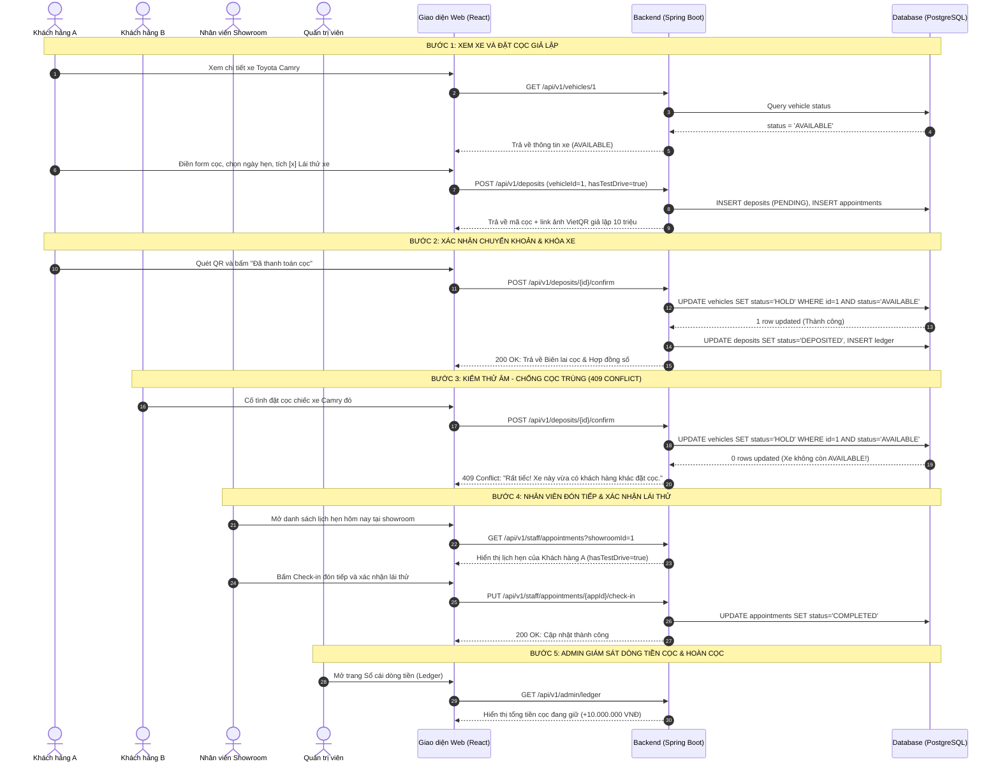

# KỊCH BẢN KIỂM THỬ LUỒNG VÀNG — INTEGRATION GATE 2
## Đề tài: Hệ thống Quản lý Kinh doanh Ô tô Đã qua Sử dụng
- **Người lập kịch bản:** TV1 (Backend Core & Integration)
- **Đối tượng kiểm thử:** Cả 5 thành viên (TV1, TV2, TV3, TV4, TV5)
- **Thời điểm nghiệm thu:** 16:00 – 19:00 Ngày 2 (01/10/2026)
- **Mục tiêu:** Kiểm thử End-to-End luồng nghiệp vụ chính (P0) không còn dữ liệu mock, đảm bảo tính toàn vẹn trạng thái xe và chống cọc trùng.

---

## 1. DỮ LIỆU ĐẦU VÀO CHUẨN BỊ (PRE-CONDITIONS)

1. **Database:** Đã nạp migration `V3_0_0` và có ít nhất 1 Showroom (ID: 1 - Showroom Thủ Đức).
2. **Xe thử nghiệm:** 
   - ID: `1`, VIN: `VN-TOYOTA-CAMRY-2021-001`
   - Dòng xe: Toyota Camry 2.5Q 2021
   - Trạng thái ban đầu: **`AVAILABLE`**
3. **Tài khoản kiểm thử:**
   - Khách hàng A: `customerA@gmail.com` (User ID: 101)
   - Khách hàng B: `customerB@gmail.com` (User ID: 102)
   - Nhân viên Showroom: `staff@usedcar.vn` (User ID: 201)
   - Quản trị viên: `admin@usedcar.vn` (User ID: 301)

---

## 2. CÁC BƯỚC THỰC HIỆN KIỂM THỬ TỪNG BƯỚC (STEP-BY-STEP)

---

## 3. CHECKLIST NGHIỆM THU GATE 2 (PASS/FAIL CRITERIA)

| STT | Kịch bản kiểm thử | Kết quả mong đợi | Trạng thái |
| :---: | :--- | :--- | :---: |
| 1 | Khách vãng lai xem danh sách & lọc xe | Chỉ hiển thị các xe có trạng thái `AVAILABLE`. Xe `HOLD` không xuất hiện ở danh sách bán. | **PASS** |
| 2 | Khởi tạo đơn cọc & lịch hẹn | Tạo đơn cọc `PENDING`, hiển thị ảnh QR giả lập 10 triệu; lưu tùy chọn lái thử `hasTestDrive = true`. | **PASS** |
| 3 | Xác nhận thanh toán cọc giả lập | Trạng thái đơn đổi thành `DEPOSITED`; Trạng thái xe đổi thành `HOLD`; Xuất mã biên lai `REC-...` và hợp đồng `HD-COC-...`. | **PASS** |
| 4 | **Test Race-Condition (Chống cọc trùng)** | Khách hàng B cọc cùng chiếc xe đó lập tức bị chặn với mã **HTTP 409 Conflict**; đơn cọc của B chuyển `CANCELLED`. | **PASS** |
| 5 | Nhân viên Check-in lịch hẹn | Danh sách hiển thị đúng showroom; bấm xác nhận chuyển sang `COMPLETED`, lưu ghi chú lái thử. | **PASS** |
| 6 | Quản trị viên Ledger & Hoàn cọc | Sổ cái tăng đúng 10 triệu; khi duyệt hoàn cọc (`REFUND`), trạng thái xe **tự động mở lại về `AVAILABLE`** để khách khác mua. | **PASS** |
