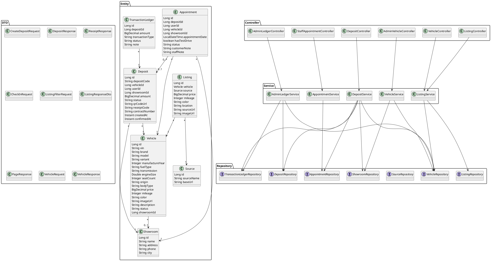

# Class Diagram — Current Implementation

Ngày đồng bộ: 30/09/2026

TV5 models only classes actually found in the repository. Auth/security classes are intentionally omitted because they are not implemented in the current backend.

## 1. Backend class diagram

## 2. Important modeling notes

- `Deposit` và `Appointment` đang giữ foreign-key IDs dạng `Long`; chúng chưa phải JPA `@ManyToOne` object relationships.
- `Deposit.userId` và `Appointment.userId` chưa có user entity/foreign key trong current database migration.
- `Vehicle.showroomId` cũng là `Long`; showroom được service load riêng.
- `ListingResponseDto` là flat DTO ghép Listing + Vehicle + Source.
- Không thêm `User`, `Role`, `JwtToken`, `Otp`, `SecurityConfig` vào class diagram cho tới khi TV4 có implementation thực tế.
