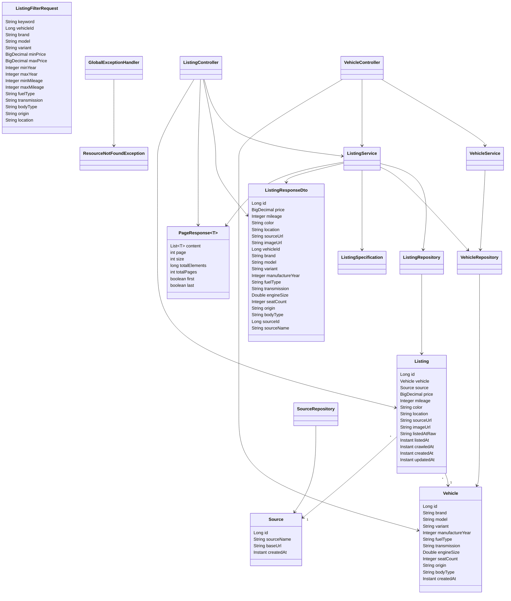

# Class Diagram — Current Implementation & P0 Design

**Owner:** TV5

## 1. Nguyên tắc

Class Diagram phải sử dụng tên class/package thực tế trong repository.

Không đưa vào diagram các class chưa tồn tại chỉ để làm đẹp sơ đồ.

Các module Auth / Deposit / Appointment chỉ được bổ sung tên class cụ thể sau khi TV4/TV1 bàn giao code.

---

## 2. Current Backend Classes



---

## 3. Package structure represented by the diagram

```text
com.system
├── controller
│   ├── VehicleController
│   └── ListingController
│
├── dto
│   ├── ListingFilterRequest
│   ├── ListingResponseDto
│   └── PageResponse
│
├── entity
│   ├── Vehicle
│   ├── Listing
│   └── Source
│
├── repository
│   ├── VehicleRepository
│   ├── ListingRepository
│   └── SourceRepository
│
├── service
│   ├── VehicleService
│   └── ListingService
│
├── specification
│   └── ListingSpecification
│
└── exception
    ├── ResourceNotFoundException
    ├── ErrorResponse
    └── GlobalExceptionHandler
```

---

## 4. Database relationship

```text
sources
    1
    │
    │
    N
listings
    N
    │
    │
    1
vehicles
```

`Listing` is the market listing entity.

`Vehicle` stores the observed vehicle configuration.

`Source` stores the marketplace/source information.

---

## 5. Current search/filter flow

```text
ListingController
       ↓
ListingService
       ↓
ListingSpecification
       ↓
ListingRepository
       ↓
PostgreSQL
```

The result is mapped to:

```text
Page<Listing>
     ↓
Page<ListingResponseDto>
     ↓
PageResponse<ListingResponseDto>
```

---

## 6. Classes not yet finalized

The following must not be invented in the diagram:

```text
AuthController
AuthService
DepositController
DepositService
AppointmentController
AppointmentService
SecurityFilter
JwtService
User
Role
Deposit
Appointment
```

They are planned by the current workflow, but their actual names and relationships must come from the implementation handed over by TV1/TV4.

---

## 7. Final synchronization rule

Before Final Gate, TV5 must compare:

```text
Class Diagram
      ↕
Java source code
      ↕
Database schema
      ↕
API contract
      ↕
Sequence Diagram
```

Any class existing only in documentation must be removed or marked pending.
