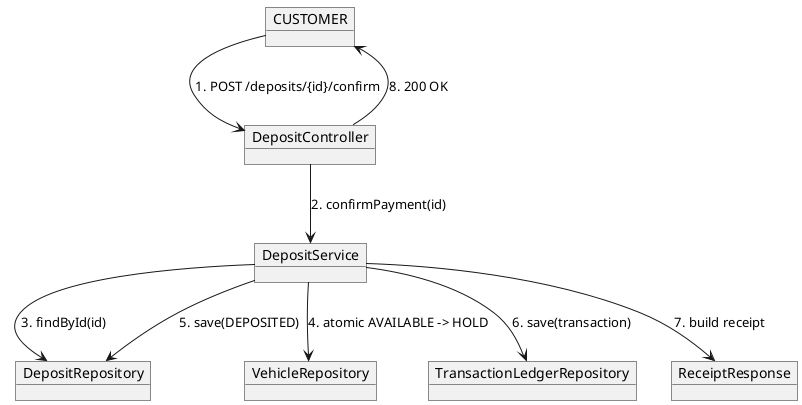
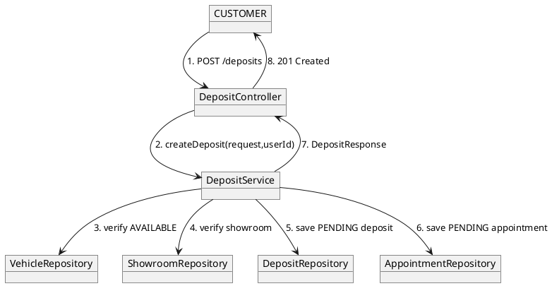
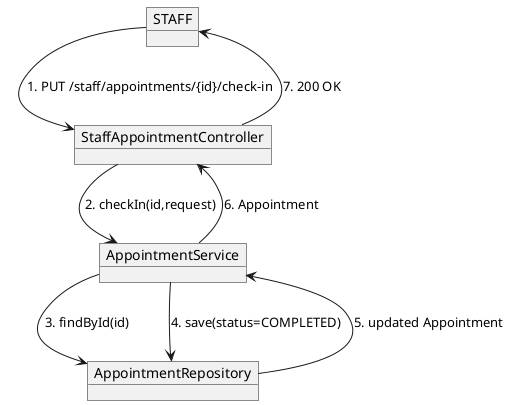
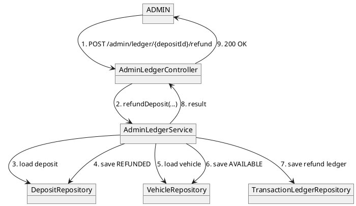

# Collaboration Diagrams — Current Business Flows

Ngày đồng bộ: 30/09/2026

## 1. Confirm deposit / lock vehicle

```plantuml
@startuml
object CUSTOMER
object DepositController
object DepositService
object DepositRepository
object VehicleRepository
object TransactionLedgerRepository
object ReceiptResponse

CUSTOMER --> DepositController : 1. POST /deposits/{id}/confirm
DepositController --> DepositService : 2. confirmPayment(id)
DepositService --> DepositRepository : 3. findById(id)
DepositService --> VehicleRepository : 4. atomic AVAILABLE -> HOLD
DepositService --> DepositRepository : 5. save(DEPOSITED)
DepositService --> TransactionLedgerRepository : 6. save(transaction)
DepositService --> ReceiptResponse : 7. build receipt
DepositController --> CUSTOMER : 8. 200 OK
@enduml
```

## 2. Create deposit + appointment

```plantuml
@startuml
object CUSTOMER
object DepositController
object DepositService
object VehicleRepository
object ShowroomRepository
object DepositRepository
object AppointmentRepository

CUSTOMER --> DepositController : 1. POST /deposits
DepositController --> DepositService : 2. createDeposit(request,userId)
DepositService --> VehicleRepository : 3. verify AVAILABLE
DepositService --> ShowroomRepository : 4. verify showroom
DepositService --> DepositRepository : 5. save PENDING deposit
DepositService --> AppointmentRepository : 6. save PENDING appointment
DepositService --> DepositController : 7. DepositResponse
DepositController --> CUSTOMER : 8. 201 Created
@enduml
```

## 3. Staff check-in

```plantuml
@startuml
object STAFF
object StaffAppointmentController
object AppointmentService
object AppointmentRepository

STAFF --> StaffAppointmentController : 1. PUT /staff/appointments/{id}/check-in
StaffAppointmentController --> AppointmentService : 2. checkIn(id,request)
AppointmentService --> AppointmentRepository : 3. findById(id)
AppointmentService --> AppointmentRepository : 4. save(status=COMPLETED)
AppointmentRepository --> AppointmentService : 5. updated Appointment
AppointmentService --> StaffAppointmentController : 6. Appointment
StaffAppointmentController --> STAFF : 7. 200 OK
@enduml
```

## 4. Admin refund

```plantuml
@startuml
object ADMIN
object AdminLedgerController
object AdminLedgerService
object DepositRepository
object VehicleRepository
object TransactionLedgerRepository

ADMIN --> AdminLedgerController : 1. POST /admin/ledger/{depositId}/refund
AdminLedgerController --> AdminLedgerService : 2. refundDeposit(...)
AdminLedgerService --> DepositRepository : 3. load deposit
AdminLedgerService --> DepositRepository : 4. save REFUNDED
AdminLedgerService --> VehicleRepository : 5. load vehicle
AdminLedgerService --> VehicleRepository : 6. save AVAILABLE
AdminLedgerService --> TransactionLedgerRepository : 7. save refund ledger
AdminLedgerService --> AdminLedgerController : 8. result
AdminLedgerController --> ADMIN : 9. 200 OK
@enduml
```
