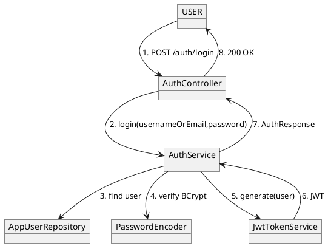
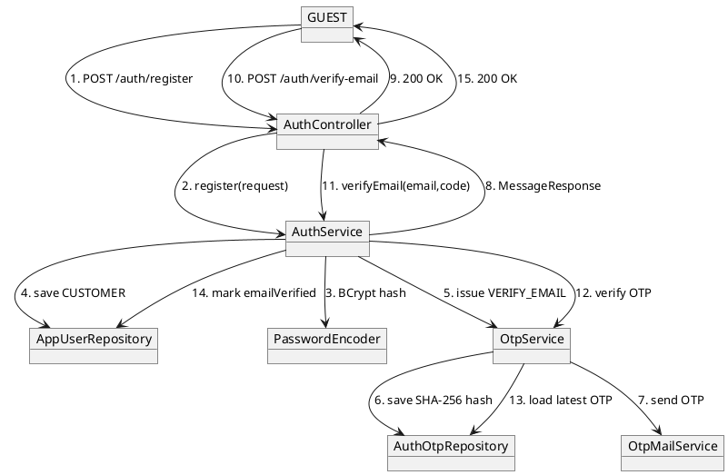
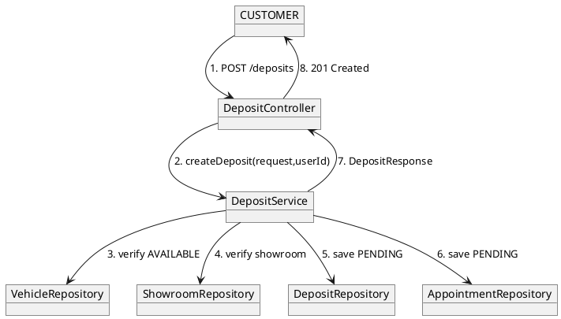
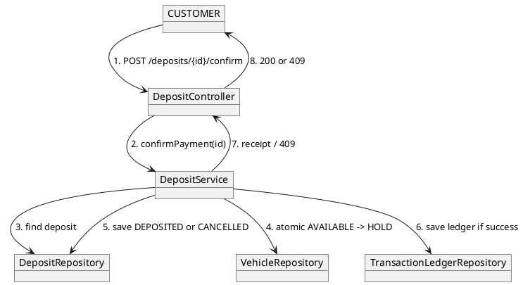
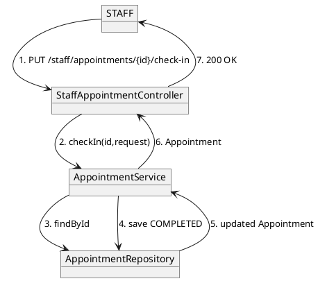
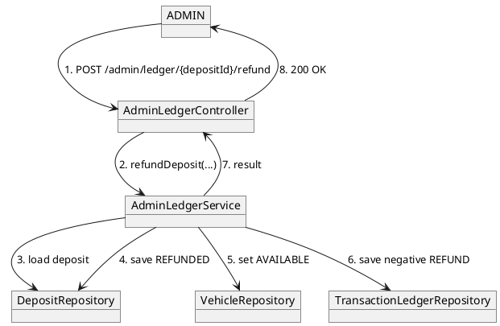

# Collaboration Diagrams — Current Business Flows

Ngày đồng bộ: 01/10/2026

## 1. Login + JWT

## 2. Register + verify email

## 3. Create deposit + appointment

**Mismatch note:** current `userId` path still comes from `X-User-Id` in the controller.

## 4. Confirm deposit / atomic lock

## 5. Staff check-in

## 6. Admin refund

