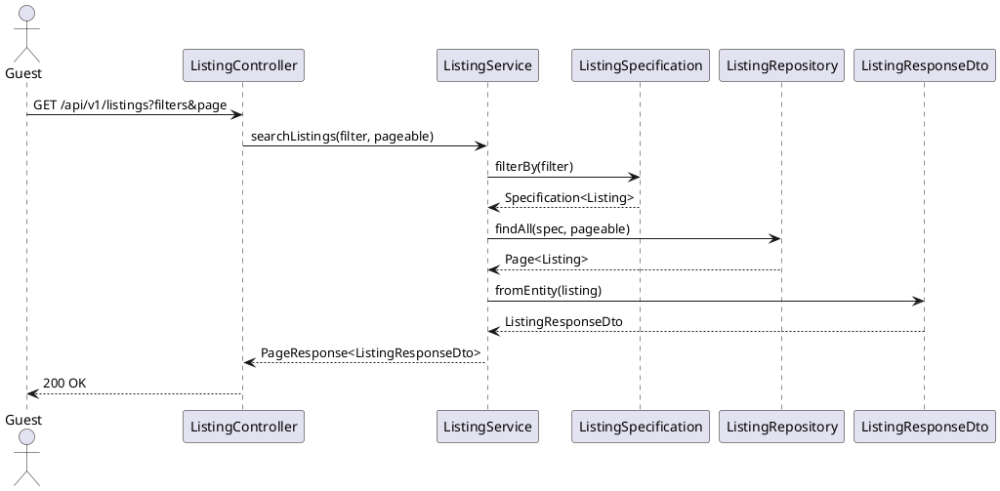
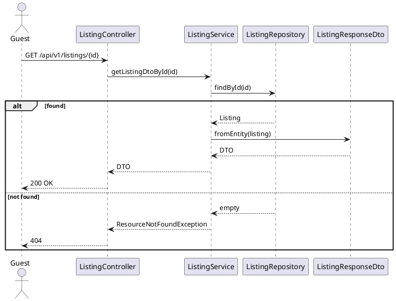
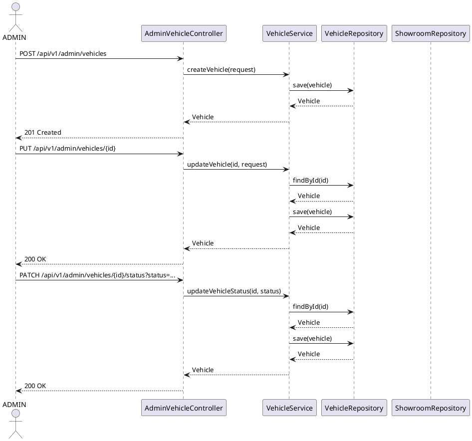
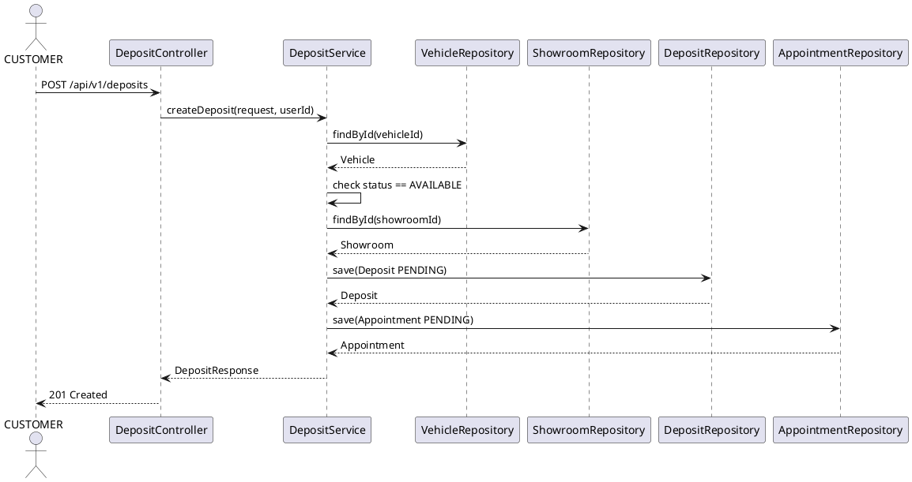
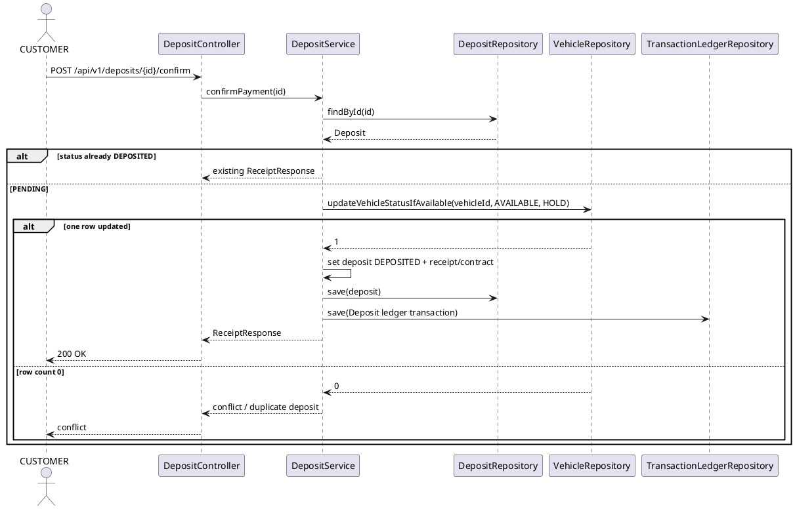
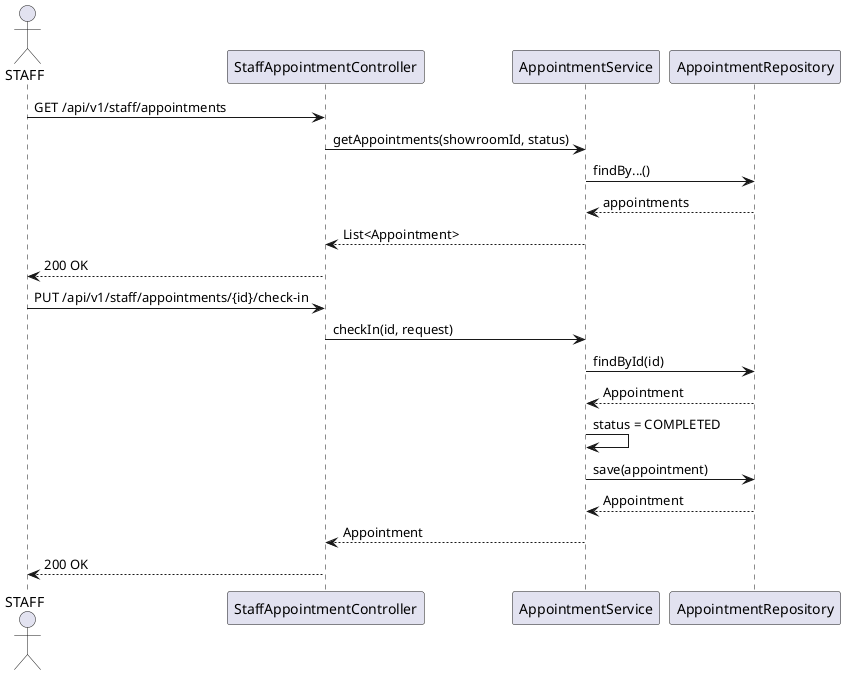
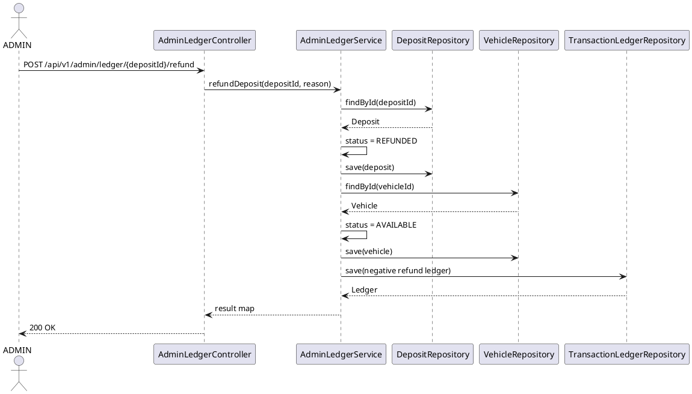

# Sequence Diagrams — Current API Flow

Ngày đồng bộ: 30/09/2026

## 1. Search / Filter Listing

## 2. View Detail

## 3. Admin CRUD Vehicle

## 4. Create Deposit + Appointment

## 5. Confirm Deposit + Atomic Vehicle Lock

## 6. Staff Check-in

## 7. Admin Refund

## 8. Auth sequence

**PENDING.** Không vẽ backend `AuthController/SecurityFilter/JWT` khi các class đó chưa có trong repository.
