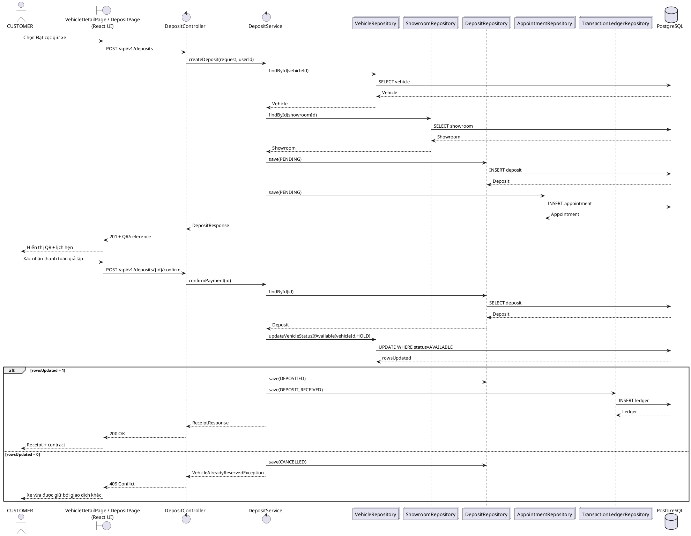
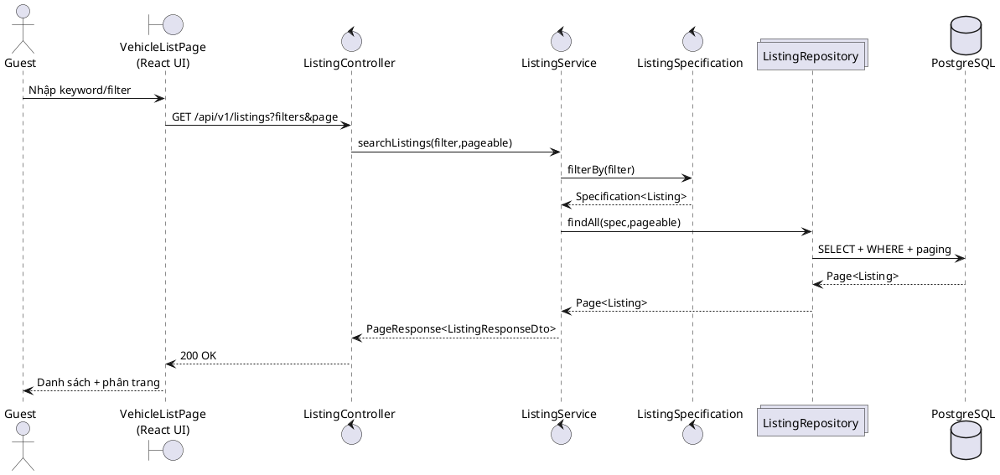
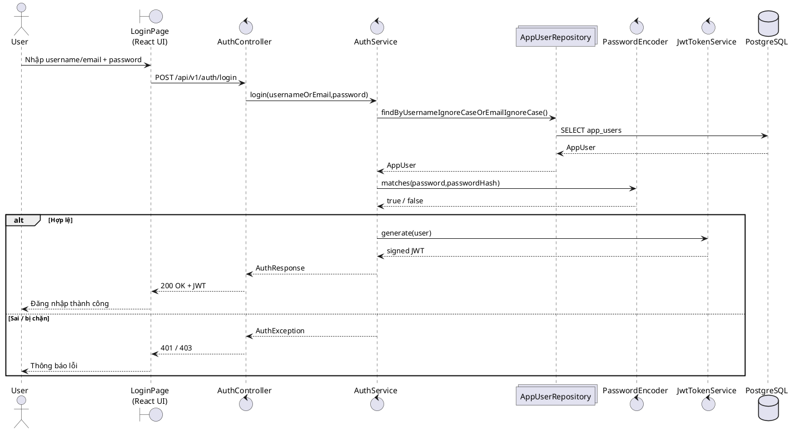
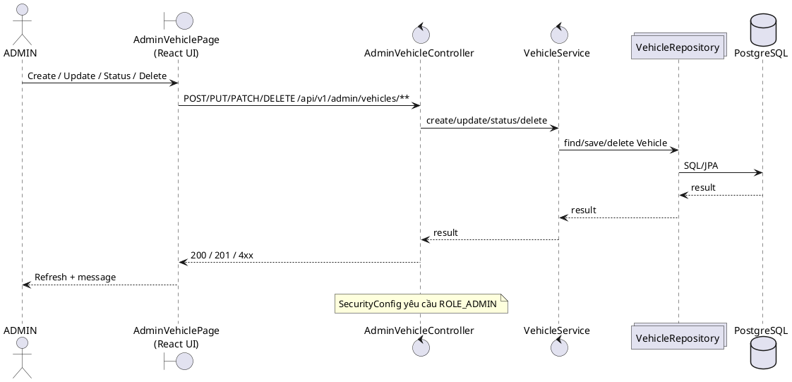
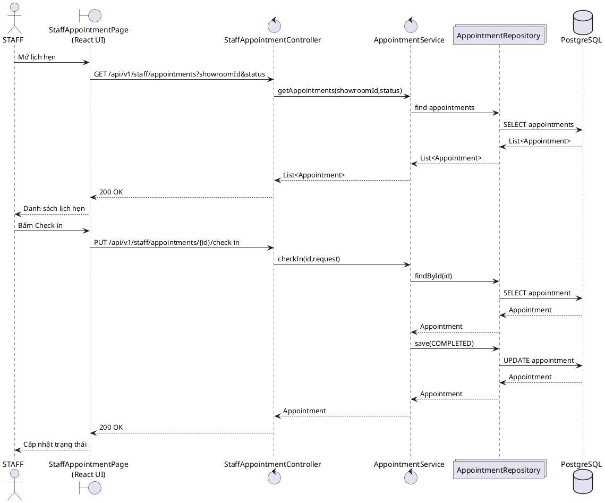
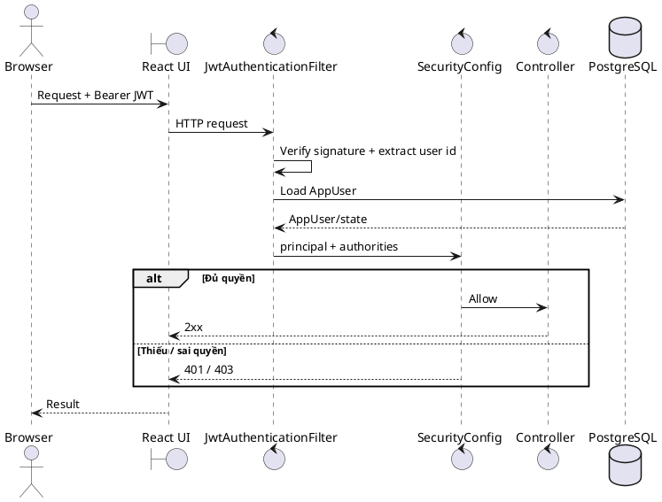

# Sequence Diagrams — TV5

Ngày đồng bộ: 01/10/2026

Quy ước ký hiệu theo mẫu:

- `actor`: người dùng.
- `boundary`: UI React/page.
- `control`: Controller/Service xử lý nghiệp vụ.
- `collections`: Repository.
- `database`: PostgreSQL.
- `alt`: nhánh nghiệp vụ/exception.

## 1. Đặt cọc + lịch hẹn + xác nhận cọc

## 2. Tìm kiếm / lọc xe

## 3. Login + JWT

## 4. Admin CRUD / trạng thái xe

## 5. Staff appointment + check-in

## 6. Security boundary

## 7. Lưu ý mismatch phải ghi trên diagram

- `DepositController.createDeposit()` hiện đọc `X-User-Id`; đây là legacy mismatch với JWT current-user contract.
- `getMyDeposits()` cũng còn `X-User-Id`.
- `confirmPayment(id)` và `getReceipt(id)` chưa nhận current-user để kiểm tra ownership.
- Không vẽ `X-User-Id` thành thiết kế mục tiêu; chỉ ghi chú mismatch hiện tại.
