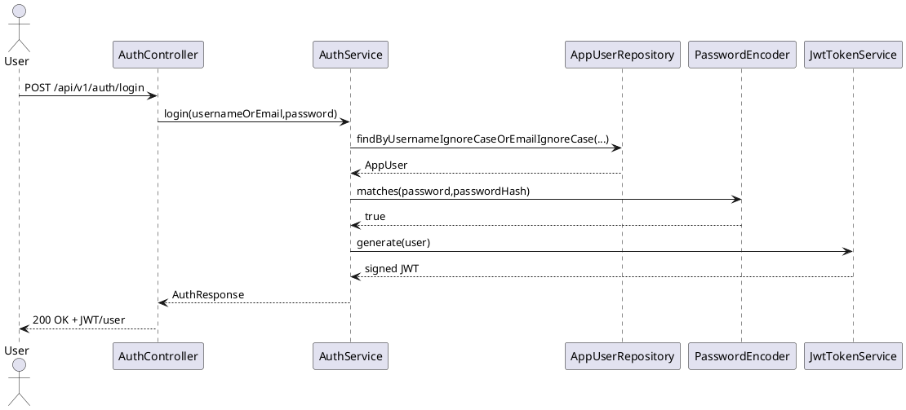
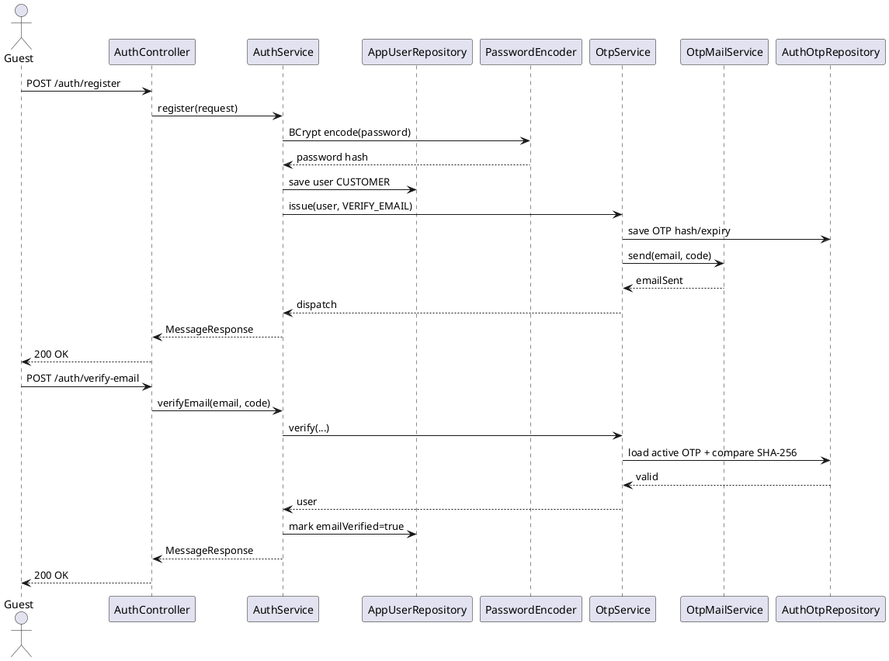
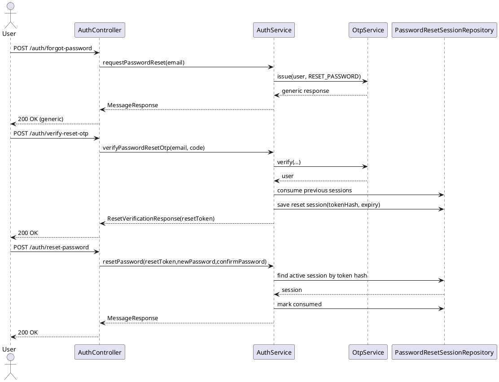
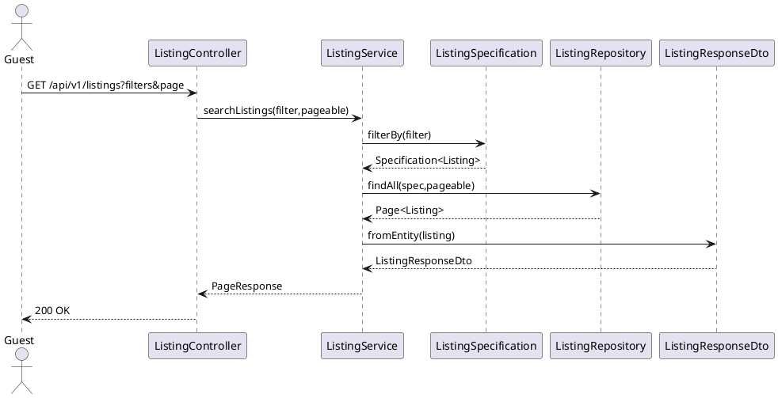
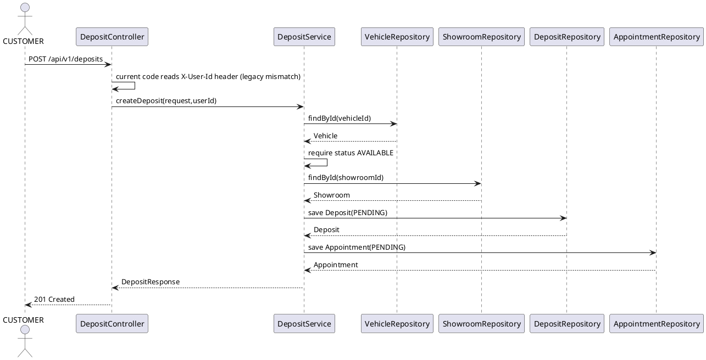
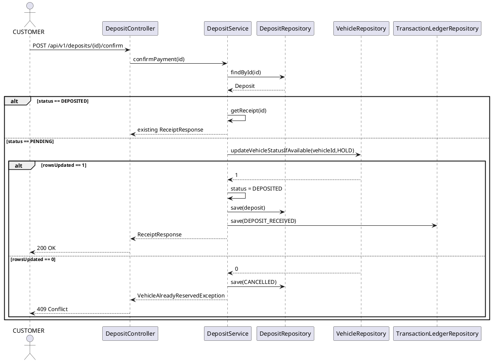
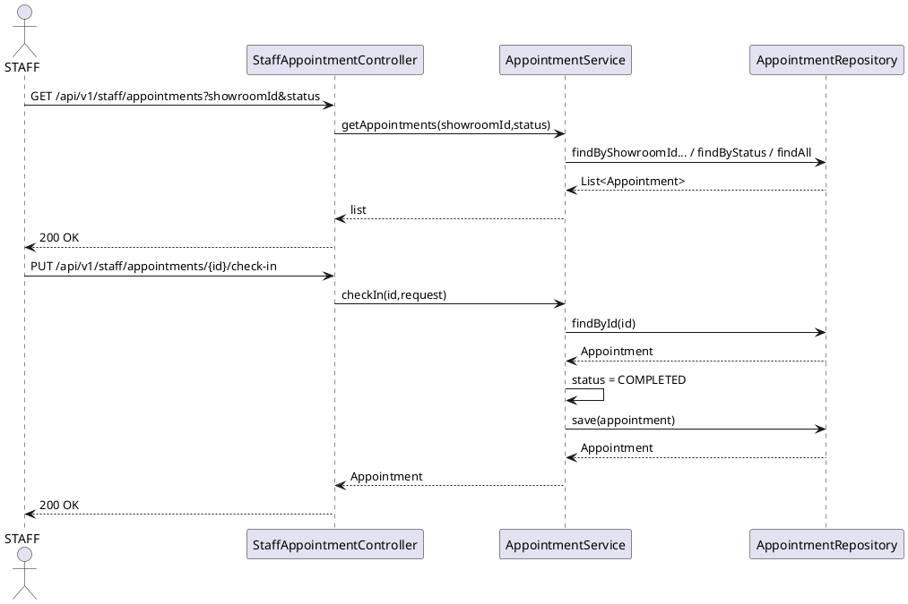
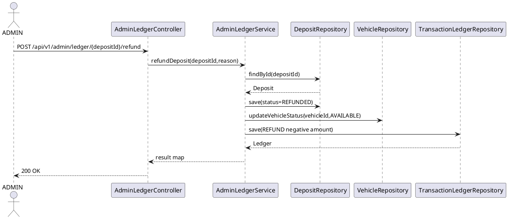
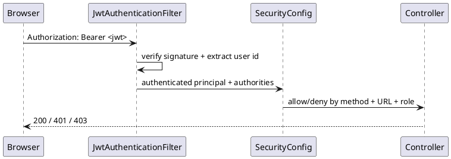

# Sequence Diagrams — Current API Flow

Ngày đồng bộ: 01/10/2026

## 1. Login + current user

## 2. Register + verify email OTP

## 3. Forgot password / reset token

## 4. Search / filter listing

## 5. Create deposit + appointment

**Target security contract:** `userId` must come from JWT `SecurityUtils.currentUser()`, not a browser-provided header.

## 6. Confirm deposit + atomic vehicle lock

**Current gap:** sequence does not contain an ownership decision because source `confirmPayment()` only accepts `depositId`.

## 7. Staff appointment/check-in

## 8. Admin refund

## 9. Security boundary

SecurityConfig currently protects `/admin/**`, `/staff/**`, deposit endpoints, `/auth/me` and logout; public GET catalog and auth bootstrap endpoints remain permitAll.
