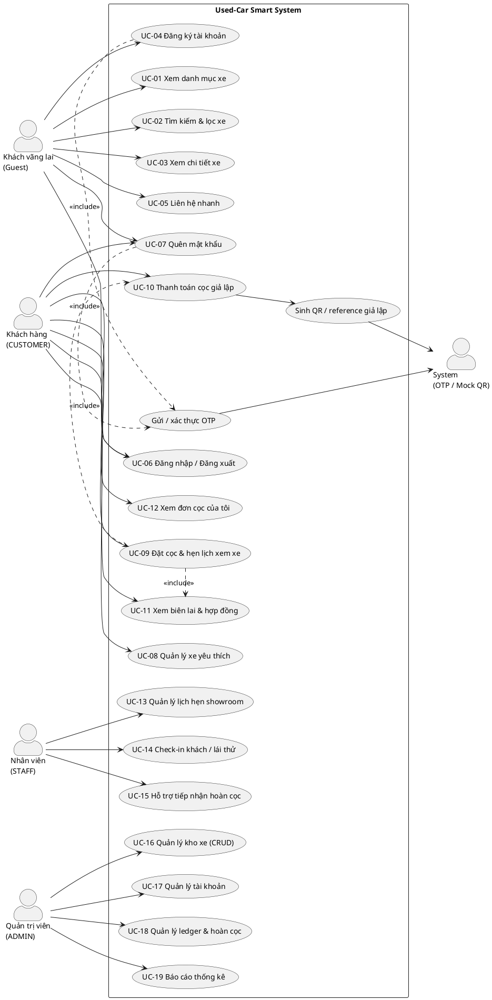

# Use Case Specification — TV5

Ngày đồng bộ: 01/10/2026

## 1. Nguyên tắc

Bộ Use Case này lấy **các nghiệp vụ trong tài liệu mô tả hệ thống** làm baseline, sau đó đối chiếu với backend/frontend hiện tại. Không thêm ML, regression, recommendation, comparison, payment thật, shopping cart hoặc workflow lái thử độc lập.

Các chức năng chưa có implementation được giữ trong Use Case với trạng thái `PENDING`/`PARTIAL`, không được mô tả thành chức năng đã hoàn thành.

## 2. Actor

| Actor | Vai trò |
|---|---|
| Guest | Xem, tìm kiếm/lọc, chi tiết, đăng ký, liên hệ, quên mật khẩu |
| CUSTOMER | Đăng nhập, yêu thích, đặt cọc, lịch hẹn, xác nhận cọc, receipt, lịch sử cọc |
| STAFF | Xem lịch hẹn, check-in khách/lái thử, nghiệp vụ hỗ trợ hoàn cọc theo tài liệu gốc |
| ADMIN | CRUD xe, tài khoản, ledger/hoàn cọc, thống kê |
| System | OTP, JWT, QR/reference và các state/transaction tự động |

## 3. Use Case diagram

## 4. Coverage / implementation status

| UC | Nghiệp vụ baseline | Implementation hiện tại | Status |
|---|---|---|---|
| UC-01 | Xem danh mục xe | `GET /api/v1/listings`, `VehicleListPage` | IMPLEMENTED |
| UC-02 | Tìm kiếm & lọc xe | `ListingSpecification`, listing API | IMPLEMENTED |
| UC-03 | Xem chi tiết xe | listing/vehicle detail API + `VehicleDetailPage` | IMPLEMENTED |
| UC-04 | Đăng ký tài khoản | `POST /api/v1/auth/register` + OTP | IMPLEMENTED |
| UC-05 | Liên hệ nhanh | Chưa có contract/backend riêng | PENDING/P2 |
| UC-06 | Đăng nhập / Đăng xuất | AuthController + JWT + AuthContext | IMPLEMENTED |
| UC-07 | Quên mật khẩu | forgot/verify-reset/reset | IMPLEMENTED |
| UC-08 | Yêu thích | Chưa có backend model/API | PENDING |
| UC-09 | Đặt cọc & hẹn lịch | `POST /api/v1/deposits` | PARTIAL — còn `X-User-Id`, validation ngày hẹn |
| UC-10 | Thanh toán cọc giả lập | `POST /deposits/{id}/confirm` | PARTIAL — ownership chưa kiểm tra current-user |
| UC-11 | Biên lai & hợp đồng | `GET /deposits/{id}/receipt` | PARTIAL — ownership/API contract cần sync |
| UC-12 | Đơn cọc của tôi | `GET /deposits/my` | PARTIAL — còn `X-User-Id` |
| UC-13 | Quản lý lịch hẹn | Staff GET appointments | IMPLEMENTED |
| UC-14 | Check-in khách/lái thử | Staff PUT check-in | IMPLEMENTED |
| UC-15 | Hỗ trợ hoàn cọc | Chưa có Staff endpoint; refund hiện ở Admin | PARTIAL / CONTRACT GAP |
| UC-16 | Admin CRUD kho xe | `AdminVehicleController` POST/PUT/PATCH/DELETE | PARTIAL — CORS PATCH/evidence còn mở |
| UC-17 | Quản lý tài khoản | Chưa có module Admin account riêng | PENDING |
| UC-18 | Ledger & hoàn cọc | `AdminLedgerController` GET/refund | PARTIAL |
| UC-19 | Báo cáo thống kê | Chưa có backend module thống kê | PENDING |

## 5. Các quan hệ nghiệp vụ bắt buộc

- UC-09 `include` UC-10: luồng đặt cọc bao gồm bước xác nhận cọc giả lập.
- UC-09 `include` UC-11: sau khi xác nhận thành công có receipt/contract data.
- UC-04 và UC-07 sử dụng OTP do System xử lý.
- `hasTestDrive` chỉ là thuộc tính checkbox của Appointment; **không tạo UC lái thử độc lập**.
- Xác nhận cọc phải bảo đảm atomic `AVAILABLE -> HOLD` để tránh hai giao dịch giữ cùng xe.

## 6. Các điểm không được vẽ thêm

Không đưa vào Use Case hiện hành: ML, regression, R Plumber, automatic valuation, recommendation, comparison, real payment gateway, shopping cart, standalone test-drive workflow.
